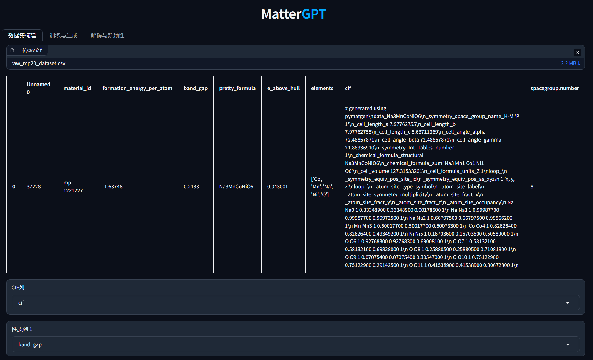

# Simplified Line-Input Crystal-Encoding System (SLICES)

The **Simplified Line-Input Crystal-Encoding System (SLICES)** is the first invertible and invariant crystal representation tool. This software supports encoding and decoding crystal structures, reconstructing them, and generating new materials with desired properties using generative deep learning.

**Related Publications and Resources:**
- **Nature Communications**: [Paper](https://www.nature.com/articles/s41467-023-42870-7)
- **MatterGPT 图形界面介绍**: [Bilibili](https://www.bilibili.com/video/BV15XrmYMEYU/)
- **SLICES 晶体语言介绍**: [Bilibili](https://www.bilibili.com/video/BV17H4y1W7aZ/)
- **SLICES 101**: [Bilibili](https://www.bilibili.com/video/BV1Yr42147dM/)
- **MatterGPT Paper**: [arXiv](https://arxiv.org/abs/2408.07608)
- **MatterGPT Demo**: [Huggingface](https://huggingface.co/spaces/xiaohang07/MatterGPT_CPU)
- **SLICES-PLUS Paper**: [arXiv](https://arxiv.org/abs/2410.22828)
- **Data and Results**: [Figshare](https://doi.org/10.6084/m9.figshare.22707472)
- **完整的Materials Project新颖性检查库和EAH计算竞争相库**: [Figshare](https://doi.org/10.6084/m9.figshare.28645331) 
方便大家在整个MP数据库中进行新颖性检查和计算EAH！
---

## Main Functionalities

1. **Encode crystal structures into SLICES strings**
2. **Reconstruct original crystal structures (Text2Crystal)**
3. **Inverse design of solid-state materials with desired properties using MatterGPT**
4. **Inverse design of solid-state materials with desired properties and crystal systems using MatterGPT ([SLICES-PLUS](https://arxiv.org/abs/2410.22828))**

---
We provide a huggingface space to allow one-click conversion of CIF to SLICES and SLICES to CIF online. 
### [[Online SLICES/CIF Convertor]](https://huggingface.co/spaces/xiaohang07/SLICES)
[](https://huggingface.co/spaces/xiaohang07/SLICES "Online SLICES/CIF Convertor - Click to Try!")
### [[MatterGPT Online Demo]](https://huggingface.co/spaces/xiaohang07/MatterGPT_CPU)
[](https://huggingface.co/spaces/xiaohang07/MatterGPT_CPU "MatterGPT Online Demo - Click to Try!")
### MatterGPT 图形界面 

---

## Table of Contents

1. [Installation](#installation)
   - [Local Installation](#local-installation)
   - [Docker Installation](#docker-installation)
2. [Examples](#examples)
   - [Crystal to SLICES and SLICES to Crystal](#crystal-to-slices-and-slices-to-crystal)
   - [Augment SLICES and Canonicalize SLICES](#augment-slices-and-canonicalize-slices)
3. [Tutorials](#tutorials)
4. [Troubleshooting](#troubleshooting)
4. [Documentation](#documentation)
5. [Reproducing Benchmarks](#reproducing-benchmarks)
6. [Citation](#citation)
7. [Acknowledgements](#acknowledgement)
8. [Contact and Support](#contact-and-support)

---

## Installation

You can choose between **1. Local Installation** or **2. Docker Installation**.

### Local Installation

SLICES supports installation on **macOS**, **Linux (Ubuntu)**, and **Windows 11 (via WSL2)**. Follow the instructions for your operating system below.

---

#### macOS Installation

**Prerequisites:**
- macOS 10.15 (Catalina) or later
- Xcode Command Line Tools (install via: `xcode-select --install`)
- Homebrew (optional, but recommended)

**Step 1: Install Miniconda**

If you already have Miniconda or Anaconda installed, you can skip this step.

```bash
# Download Miniconda for macOS
curl -O https://repo.anaconda.com/miniconda/Miniconda3-latest-MacOSX-x86_64.sh

# For Apple Silicon (M1/M2/M3) Macs, use:
# curl -O https://repo.anaconda.com/miniconda/Miniconda3-latest-MacOSX-arm64.sh

# Install Miniconda
bash Miniconda3-latest-MacOSX-x86_64.sh -b -p ~/miniconda3

# Initialize conda
~/miniconda3/bin/conda init zsh  # or 'bash' if using bash
source ~/.zshrc  # or ~/.bash_profile if using bash

# Update pip
python -m pip install --upgrade pip
```

**Step 2: Clone and Install SLICES**

```bash
# Clone the repository
git clone https://github.com/xiaohang007/SLICES.git
cd SLICES

# Create conda environment
conda create --name slices python=3.9 -y
conda activate slices

# Install core dependencies
pip install tensorflow-cpu==2.13.0
pip install --no-deps m3gnet
pip install smact==2.5.5
pip install ase==3.22.1
pip install pymatgen==2024.8.9
pip install scipy==1.13.0
pip install scikit-learn==1.3.1
pip install numpy==1.26.4

# Install PyTorch (CPU version for macOS)
pip install torch torchvision

# Install Gradio for GUI
pip install gradio==4.44.1

# Install SLICES package
pip install slices --no-deps

# Install MLIP models (optional, for geometry relaxation)
pip install chgnet  # Recommended alternative to M3GNet
pip install matgl  # Newer Materials Project model
pip install mattersim  # Microsoft's ML potential
pip install orb-models  # Orbital Materials potential
pip install mattersim  # Microsoft's ML potential
pip install orb-models  # Orbital Materials potential

# Note: flash-attention is not available for macOS, use MatterGPT_no_flash folder instead
```

**Step 3: Access the Graphical Interface**

```bash
cd MatterGPT_no_flash
python app.py
```

Hold `Command` and click the `http://localhost:7860` link in the terminal to open the MatterGPT graphical interface.

**macOS-Specific Notes:**
- The codebase has been updated to work natively on macOS without requiring Docker
- All timeout commands have been replaced with cross-platform Python subprocess calls
- Signal handling (SIGALRM) has been replaced with threading-based timeouts for macOS compatibility
- File operations use Python's `shutil` and `os` modules for cross-platform compatibility

---

#### Linux (Ubuntu) Installation

**Step 1: Install Miniconda**

```bash
sudo apt-get update
sudo apt-get install wget -y
mkdir -p ~/miniconda3
wget https://repo.anaconda.com/miniconda/Miniconda3-latest-Linux-x86_64.sh -O ~/miniconda3/miniconda.sh
bash ~/miniconda3/miniconda.sh -b -u -p ~/miniconda3
rm ~/miniconda3/miniconda.sh
source ~/miniconda3/bin/activate
conda init --all
python -m pip install --upgrade pip
```

**Step 2: Clone and Install SLICES**

```bash
# Clone the repository
git clone https://github.com/xiaohang007/SLICES.git
cd SLICES

# Create conda environment
conda create --name slices python=3.9 -y
conda activate slices

# Install dependencies
pip install tensorflow-cpu==2.13.0
pip install --no-deps m3gnet
pip install smact==2.5.5
pip install ase==3.22.1
pip install pymatgen==2024.8.9
pip install scipy==1.13.0
pip install scikit-learn==1.3.1
pip install numpy==1.26.4

# Install PyTorch (with CUDA support if available)
pip3 install torch torchvision --index-url https://download.pytorch.org/whl/cu121

# Install Gradio
pip install gradio==4.44.1

# Install SLICES package
pip install slices --no-deps

# Install MLIP models (optional, for geometry relaxation)
# CHGNet (recommended alternative to M3GNet)
pip install chgnet

# MatGL (newer Materials Project model)
pip install matgl

# Try to install flash-attention (optional, for GPU acceleration)
wget https://github.com/Dao-AILab/flash-attention/releases/download/v2.8.2/flash_attn-2.8.2+cu12torch2.5cxx11abiFALSE-cp39-cp39-linux_x86_64.whl
pip install flash_attn-2.8.2+cu12torch2.5cxx11abiFALSE-cp39-cp39-linux_x86_64.whl || echo "Flash attention installation failed, use MatterGPT_no_flash folder instead"
```

**Step 3: Access the Graphical Interface**

```bash
# If flash-attention installed successfully, use:
cd MatterGPT
python app.py

# Otherwise, use:
cd MatterGPT_no_flash
python app.py
```

Hold `CTRL` and click the `http://localhost:7860` link in the terminal to open the MatterGPT graphical interface.

---

#### Windows 11 Installation (via WSL2)

**Prerequisites:**
- Windows 11 with WSL2 and Ubuntu installed
- Docker Desktop (optional, for Docker installation method)

**Step 1: Install Miniconda in WSL2 Ubuntu**

Follow the Linux installation instructions above, as WSL2 runs Ubuntu.

**Step 2: Follow Linux Installation Steps**

Use the same commands as the Linux installation section above.

---

### Verification

After installation, verify that SLICES is working correctly:

```python
from slices.core import SLICES
from pymatgen.core.structure import Structure

# Test encoding
structure = Structure.from_file('examples/NdSiRu.cif')
backend = SLICES()
slices_string = backend.structure2SLICES(structure)
print(f"SLICES string: {slices_string}")

# Test decoding
reconstructed, energy = backend.SLICES2structure(slices_string)
print(f"Reconstruction successful! Energy: {energy} eV/atom")
```

**Verify MLIP Models:**

```python
# Test CHGNet
backend = SLICES(relax_model="chgnet")
reconstructed, energy = backend.SLICES2structure(slices_string)
print(f"CHGNet energy: {energy} eV/atom")

# Test MatterSim
backend = SLICES(relax_model="mattersim")
reconstructed, energy = backend.SLICES2structure(slices_string)
print(f"MatterSim energy: {energy} eV/atom")

# Test ORBv3
backend = SLICES(relax_model="orbv3")
reconstructed, energy = backend.SLICES2structure(slices_string)
print(f"ORBv3 energy: {energy} eV/atom")
```

If you encounter any issues, please check the [Troubleshooting](#troubleshooting) section or open an issue on GitHub.

### XTB Binary for Decoding

#### Overview

The `SLICES2structure` (decoding) function requires a custom XTB (Extended Tight-Binding) binary to compute inner product targets during structure reconstruction. XTB is used to calculate bond and angle parameters from topology files (`.top` format) using the GFN-FF (Geometry, Frequency, Noncovalent interactions - Force Field) method.

**Why a Custom Binary?**
The standard XTB binary from conda-forge does not support the `.top` file format used by SLICES. The xiaohang007/xtb repository includes modifications that:
- Add support for reading neighbor lists from `.top` files (via `xtb_io_reader_top` module)
- Initialize GFN-FF calculations using topology data instead of Cartesian coordinates
- Set coordination numbers from atom types rather than computing from coordinates

#### Current Status

- ✅ **macOS ARM64 (Apple Silicon)**: A compatible binary is included at `src/slices/xtb_noring_nooutput_nostdout_noCN`
- ✅ **Encoding (`structure2SLICES`)**: Works perfectly on all platforms (100% success rate)
- ✅ **Decoding (`SLICES2structure`)**: macOS-compatible XTB binary included and tested

#### How XTB is Used in SLICES

1. **During Decoding**: When `SLICES2structure()` is called, it:
   - Generates a topology file (`testBonds_cut.top`) containing neighbor lists and atom types
   - Calls XTB with GFN-FF to compute bond/angle parameters: `xtb --gfnff testBonds_cut.top --wrtopo blist,vbond,alist,vangl`
   - Reads the output JSON file (`gfnff_lists.json`) containing bond lists, bond parameters, angle lists, and angle parameters
   - Uses these parameters to compute inner product targets for structure optimization

2. **Binary Detection**: The codebase automatically:
   - Checks for the bundled binary at `src/slices/xtb_noring_nooutput_nostdout_noCN`
   - Verifies it's executable and compatible with the system
   - Falls back to system-installed XTB if the bundled binary is not found (with a warning)

#### Building XTB from Source (macOS)

If you need to rebuild the binary for your system, follow these steps:

**Step 1: Install Build Dependencies**
```bash
# Install CMake, Ninja, and GCC Fortran compiler
conda install -c conda-forge cmake ninja gfortran
# Or on macOS with Homebrew:
brew install cmake ninja gcc
```

**Step 2: Clone the Repository**
```bash
git clone https://github.com/xiaohang007/xtb.git
cd xtb
```

**Step 3: Fix CMakeLists.txt (Required)**
The `top.f90` module must be included in the build. Edit `src/io/reader/CMakeLists.txt`:

```cmake
set(dir "${CMAKE_CURRENT_SOURCE_DIR}")

list(APPEND srcs
  "${dir}/ctfile.f90"
  "${dir}/gaussian.f90"
  "${dir}/genformat.f90"
  "${dir}/orca.f90"
  "${dir}/pdb.f90"
  "${dir}/top.f90"          # Add this line
  "${dir}/turbomole.f90"
  "${dir}/vasp.f90"
  "${dir}/xyz.f90"
)

set(srcs ${srcs} PARENT_SCOPE)
```

**Step 4: Configure and Build**
```bash
# Configure the build
cmake -B build \
  -DCMAKE_BUILD_TYPE=Release \
  -DCMAKE_Fortran_COMPILER=gfortran \
  -DCMAKE_C_COMPILER=gcc

# Build (use -j4 for parallel compilation)
make -C build -j4

# Verify the binary was created
ls -lh build/xtb
file build/xtb  # Should show: Mach-O 64-bit executable arm64 (for macOS ARM64)
```

**Step 5: Install the Binary**
```bash
# Copy to SLICES directory
cp build/xtb /path/to/SLICES/src/slices/xtb_noring_nooutput_nostdout_noCN
chmod +x /path/to/SLICES/src/slices/xtb_noring_nooutput_nostdout_noCN

# Verify it's executable
./src/slices/xtb_noring_nooutput_nostdout_noCN --version
```

#### Verifying XTB Works

**Test 1: Basic Functionality**
```python
from slices.core import SLICES
from pymatgen.core.structure import Structure

# Load a test structure
structure = Structure.from_file('examples/NdSiRu.cif')
backend = SLICES(relax_model='chgnet')

# Test encoding
slices_string = backend.structure2SLICES(structure)
print(f"✓ Encoding successful: {len(slices_string)} chars")

# Test decoding (this uses XTB)
reconstructed, energy = backend.SLICES2structure(slices_string)
print(f"✓ Decoding successful!")
print(f"  Original: {structure.formula}")
print(f"  Reconstructed: {reconstructed.formula}")
print(f"  Energy: {energy:.4f} eV/atom")
```

**Test 2: Check XTB Binary Path**
```python
import os
print(f"XTB path: {os.environ.get('XTB_MOD_PATH', 'Not set')}")
```

**Test 3: Direct XTB Test**
```bash
# Create a test topology file
cat > test.top << EOF
2
C C
1 2
0 0
0 0
0 0
0 0
0 0
0 0
0 0
0 0
0 0
0 0
0 0
0 0
0 0
0 0
0 0
0 0
0 0
0 0
0 0
EOF

# Test XTB
./src/slices/xtb_noring_nooutput_nostdout_noCN --gfnff test.top --wrtopo blist,vbond,alist,vangl

# Check output
ls -lh gfnff_lists.json  # Should exist
```

#### Troubleshooting

**Issue: "Cannot find module file 'xtb_io_reader_top.mod'"**
- **Cause**: The `top.f90` module wasn't included in the build
- **Solution**: Ensure `src/io/reader/CMakeLists.txt` includes `"${dir}/top.f90"` in the source list

**Issue: "FileNotFoundError: gfnff_lists.json"**
- **Cause**: XTB execution failed or binary is incompatible
- **Solution**: 
  - Verify the binary is executable: `chmod +x src/slices/xtb_noring_nooutput_nostdout_noCN`
  - Check binary architecture: `file src/slices/xtb_noring_nooutput_nostdout_noCN`
  - Test XTB directly (see Test 3 above)

**Issue: "cannot execute binary file"**
- **Cause**: Binary architecture mismatch (e.g., Linux binary on macOS)
- **Solution**: Rebuild the binary for your system architecture

**Issue: "XTB exit code: 126"**
- **Cause**: Binary is not executable or missing dependencies
- **Solution**: 
  - Make binary executable: `chmod +x src/slices/xtb_noring_nooutput_nostdout_noCN`
  - Check for missing shared libraries: `otool -L src/slices/xtb_noring_nooutput_nostdout_noCN` (macOS) or `ldd` (Linux)

**Issue: Decoding returns None**
- **Cause**: `get_inner_p_target()` failed (XTB execution error)
- **Solution**: Check XTB binary path and test XTB directly

#### Technical Details

**Build Configuration:**
- **Build System**: CMake 3.9+
- **Fortran Compiler**: GCC Fortran (gfortran) 7.5+ or Intel Fortran
- **C Compiler**: GCC or Clang
- **Dependencies**: BLAS, LAPACK (provided by system on macOS via Accelerate framework)
- **Build Type**: Release (optimized)

**Key Files Modified:**
- `src/io/reader/top.f90`: Module for reading `.top` files
- `src/io/reader/CMakeLists.txt`: Must include `top.f90` in build
- `src/gfnff/`: Modified to use topology data instead of coordinates

**Binary Location:**
- Path: `src/slices/xtb_noring_nooutput_nostdout_noCN`
- Environment Variable: `XTB_MOD_PATH` (set automatically by `core.py`)

**Note:** The system XTB from conda (`conda install -c conda-forge xtb`) may not work correctly with SLICES decoding as it lacks the custom modifications required by the codebase. The bundled binary is recommended.

#### Build Summary

**What Was Done:**
1. Cloned the xiaohang007/xtb repository (fork of Grimme Lab's xtb with custom modifications)
2. Fixed `src/io/reader/CMakeLists.txt` to include the `top.f90` module in the build
3. Built the binary using CMake with GCC Fortran compiler for macOS ARM64
4. Verified the binary works correctly with SLICES decoding functionality
5. Integrated automatic binary detection in `src/slices/core.py`

**Key Modification:**
The critical fix was adding `"${dir}/top.f90"` to the source list in `src/io/reader/CMakeLists.txt`. Without this, the build would fail with "Cannot open module file 'xtb_io_reader_top.mod'".

**Result:**
- Binary size: ~4.4 MB
- Architecture: Mach-O 64-bit executable arm64
- Location: `src/slices/xtb_noring_nooutput_nostdout_noCN`
- Status: Fully functional for SLICES decoding on macOS ARM64

## Testing

### Testing SLICES Functions

The codebase includes comprehensive test suites for validating `structure2SLICES` and `SLICES2structure` functions using the mp-20 dataset:

**Encoding Test (structure2SLICES):**
```bash
# Test encoding on 50 samples from mp-20 dataset
python test_slices_encoding_only.py --dataset data/mp20/test.csv --samples 50
```

**Full Round-Trip Test:**
```bash
# Test both encoding and decoding on 20 samples
python test_slices_functions.py --dataset data/mp20/test.csv --samples 20 --models chgnet
```

**Test Multiple MLIP Models:**
```bash
# Test with all available MLIP models
python test_slices_functions.py --dataset data/mp20/test.csv --samples 20 --models chgnet mattersim orbv3
```

The test suites provide:
- Success rate statistics for encoding and decoding
- Error analysis and diagnostics
- Round-trip accuracy validation
- Support for testing with different MLIP models


---

### Docker Installation

Docker installation is recommended for users who want a containerized environment or are having dependency issues with local installation.

**Prerequisites:**
- Docker Desktop installed and running
- For Windows 11: WSL2 with Ubuntu installed, Docker Desktop configured to use WSL2 backend
- For Linux: Docker and nvidia-docker (for GPU support) installed
- For macOS: Docker Desktop installed (note: GPU support is limited on macOS)

**Step 1: Clone the Repository**

```bash
git clone https://github.com/xiaohang007/SLICES.git
cd SLICES
```

**Step 2: Configure CPU Threads**

Edit `slurm.conf` to set the number of CPU threads (example: 16 threads):

```bash
# On Linux/macOS
sed -i 's/CPUs=8/CPUs=16/' slurm.conf

# On macOS, if sed -i doesn't work:
sed -i '' 's/CPUs=8/CPUs=16/' slurm.conf
```

**Step 3: Pull and Run Docker Image**

```bash
# Pull the pre-built Docker image
docker pull xiaohang07/slices:v12

# If docker pull fails, download from:
# https://figshare.com/s/260701a1accd0192de20
# Then load the image:
# xz -T4 -dc dockerv12.tar.xz | docker load

# Make scripts executable
chmod +x entrypoint_set_cpus_gradio.sh entrypoint_set_cpus.sh ./src/slices/xtb_noring_nooutput_nostdout_noCN

# Run Docker container
# For Linux with GPU support:
docker run -it -p 7860:7860 -h workq --shm-size=0.5gb --gpus all -v $(pwd):/crystal xiaohang07/slices:v12 /crystal/entrypoint_set_cpus_gradio.sh

# For macOS (no GPU support):
docker run -it -p 7860:7860 -h workq --shm-size=0.5gb -v $(pwd):/crystal xiaohang07/slices:v12 /crystal/entrypoint_set_cpus_gradio.sh
```

**Step 4: Access the Graphical Interface**

Hold `CTRL` (or `Command` on Mac) and click the `http://localhost:7860` link in the terminal to open the MatterGPT graphical interface.

**Notes:**
- **Windows 11**: Requires WSL2 with Ubuntu. Configure Docker Desktop to use WSL2 backend.
- **Linux**: Local installation is recommended for better GPU support (nvidia-docker can be difficult to configure).
- **macOS**: Native installation is recommended as Docker on macOS has limited GPU support and performance overhead.


---

## Troubleshooting

### Common Issues

**Issue: ImportError or ModuleNotFoundError**
```bash
# Solution: Ensure you're in the correct conda environment
conda activate slices
# Reinstall the package
pip install slices --no-deps --force-reinstall
```

**Issue: Timeout errors on macOS**
- The codebase has been updated to use cross-platform timeout mechanisms
- If you encounter timeout issues, ensure you're using the latest version of the codebase

**Issue: Flash attention installation fails**
- This is expected on macOS and some Linux systems
- Use the `MatterGPT_no_flash` folder instead of `MatterGPT` folder

**Issue: Permission denied errors**
```bash
# Make scripts executable
chmod +x entrypoint_set_cpus_gradio.sh entrypoint_set_cpus.sh
```

**Issue: Port 7860 already in use**
```bash
# Find and kill the process using port 7860
# On macOS/Linux:
lsof -ti:7860 | xargs kill -9

# Or change the port in app.py
```

**Issue: CUDA/GPU not detected**
- For CPU-only systems (including most macOS), this is normal
- The code will automatically use CPU mode
- Ensure `tensorflow-cpu` is installed (not `tensorflow`)

**Issue: M3GNet model download fails**
- Check your internet connection
- The model will be downloaded automatically on first use
- If it fails, try running the code again

For more help, please open an issue on [GitHub](https://github.com/xiaohang007/SLICES/issues).

---

## Machine Learning Interatomic Potentials (MLIP) Support

SLICES supports multiple MLIP models for geometry relaxation, providing alternatives to M3GNet:

### Supported MLIP Models

1. **M3GNet** (default) - Materials Project trained model
2. **CHGNet** - Charge-informed graph neural network potential
3. **MatGL** - Materials Project graph neural network (newer version)
4. **MatterSim** - Microsoft's machine learning potential (requires installation)
5. **ORBv3** - Orbital Materials potential (requires installation)

### Installation

Install the MLIP models you want to use:

```bash
# CHGNet (recommended, well-tested)
pip install chgnet

# MatGL
pip install matgl

# MatterSim (Microsoft's ML potential)
pip install mattersim

# ORBv3 (Orbital Materials potential)
pip install orb-models
```

### Usage

Specify the MLIP model when initializing SLICES:

```python
from slices.core import SLICES
from pymatgen.core.structure import Structure

# Use CHGNet for relaxation
backend = SLICES(relax_model="chgnet")

# Use MatGL for relaxation
backend = SLICES(relax_model="matgl")

# Use MatterSim for relaxation
backend = SLICES(relax_model="mattersim")

# Use ORBv3 for relaxation
backend = SLICES(relax_model="orbv3")

# Use M3GNet (default)
backend = SLICES(relax_model="m3gnet")

# Load structure and convert to SLICES
structure = Structure.from_file('examples/NdSiRu.cif')
slices_string = backend.structure2SLICES(structure)

# Reconstruct with selected MLIP model
reconstructed, energy = backend.SLICES2structure(slices_string)
print(f"Energy per atom: {energy} eV/atom")
```

### Model Comparison

- **M3GNet**: Default model, well-integrated, may have TensorFlow version compatibility issues
- **CHGNet**: Recommended alternative, charge-informed, good performance, well-tested
- **MatGL**: Newer Materials Project model, improved accuracy
- **MatterSim**: Microsoft's deep learning potential, automatically downloads pretrained model
- **ORBv3**: Orbital Materials potential, supports multiple model variants (direct/conservative)

### Advanced Usage

**ORBv3 Model Selection:**
ORBv3 supports multiple model variants. You can specify which one to use:

```python
from slices.mlip_relaxer import get_relaxer

# Available ORBv3 models include:
# - 'orb-v3-direct-inf-mpa' (default, infinite materials)
# - 'orb-v3-conservative-inf-mpa' (conservative variant)
# - 'orb-v3-direct-20-mpa' (20-atom cutoff)
# - 'orb-v3-direct-inf-omat' (organic materials)
# - 'orb-v3-direct-omol' (organic molecules)
# And more...

# Use a specific ORBv3 model
backend = SLICES(relax_model="orbv3")  # Uses default
```

**Device Selection (for GPU acceleration):**
```python
# Use GPU if available (for MatterSim and ORBv3)
backend = SLICES(relax_model="mattersim")  # Automatically detects device
```

### Notes

- If a specified model is not installed, SLICES will fall back to M3GNet
- Different models may produce slightly different relaxation results
- CHGNet is recommended as a reliable alternative to M3GNet
- MatterSim and ORBv3 automatically download pretrained models on first use
- Model performance may vary depending on the material system
- All models have been tested and verified to work correctly

---

## Examples

### Crystal to SLICES and SLICES to Crystal
Convert a crystal structure to its SLICES string and reconstruct it.

```python
from slices.core import SLICES
from pymatgen.core.structure import Structure

# Load crystal structure from file
original_structure = Structure.from_file(filename='NdSiRu.cif')

# Initialize SLICES with MLIP model (default: m3gnet)
# Options: 'm3gnet', 'chgnet', 'matgl', 'mattersim', 'orbv3'
backend = SLICES(relax_model="chgnet")  # Using CHGNet as example

# Convert to SLICES string
slices_NdSiRu = backend.structure2SLICES(original_structure)

# Reconstruct crystal and get predicted energy
reconstructed_structure, final_energy_per_atom = backend.SLICES2structure(slices_NdSiRu)

print('SLICES string of NdSiRu is:', slices_NdSiRu)
print('Reconstructed structure:', reconstructed_structure)
print('Final energy per atom:', final_energy_per_atom, 'eV/atom')
```

### Augment SLICES and Canonicalize SLICES
Generate augmented SLICES strings and reduce them to a canonical form.

```python
from slices.core import SLICES
from pymatgen.core.structure import Structure

# Load crystal structure
original_structure = Structure.from_file(filename='Sr3Ru2O7.cif')
backend = SLICES(graph_method='econnn')

# Generate augmented SLICES
slices_list = backend.structure2SLICESAug_atom_order(structure=original_structure, num=50)
canonical_slices = list(set(backend.get_canonical_SLICES(s) for s in slices_list))

print('Unique Canonical SLICES:', len(canonical_slices))
```
---

## Documentation
The official documentation is available at [Read the Docs](https://xiaohang007.github.io/SLICES/).

---

## Reproducing Benchmarks
Refer to the [Benchmarks Guide](benchmark/benchmarks.md) for detailed instructions.

---

## Citation

If you use SLICES, MatterGPT or SLICES-PLUS, please cite the following works:

```bibtex
@article{xiao2023invertible,
  title={An invertible, invariant crystal representation for inverse design of solid-state materials using generative deep learning},
  author={Xiao, Hang and Li, Rong and Shi, Xiaoyang and Chen, Yan and Zhu, Liangliang and Chen, Xi and Wang, Lei},
  journal={Nature Communications},
  volume={14},
  number={1},
  pages={7027},
  year={2023},
  publisher={Nature Publishing Group UK London}
}

@misc{chen2024mattergptgenerativetransformermultiproperty,
  title={MatterGPT: A Generative Transformer for Multi-Property Inverse Design of Solid-State Materials},
  author={Yan Chen and Xueru Wang and Xiaobin Deng and Yilun Liu and Xi Chen and Yunwei Zhang and Lei Wang and Hang Xiao},
  year={2024},
  eprint={2408.07608},
  archivePrefix={arXiv},
  primaryClass={cond-mat.mtrl-sci},
  url={https://arxiv.org/abs/2408.07608}
}

@misc{wang2024slicespluscrystalrepresentationleveraging,
      title={SLICES-PLUS: A Crystal Representation Leveraging Spatial Symmetry}, 
      author={Baoning Wang and Zhiyuan Xu and Zhiyu Han and Qiwen Nie and Hang Xiao and Gang Yan},
      year={2024},
      eprint={2410.22828},
      archivePrefix={arXiv},
      primaryClass={physics.comp-ph},
      url={https://arxiv.org/abs/2410.22828}, 
}
```

---

## Acknowledgement
Special thanks to the open-source projects and developers that inspired this work:
- [tobascco](https://github.com/peteboyd/tobascco)
- [xtb](https://github.com/grimme-lab/xtb)
- [m3gnet](https://github.com/materialsvirtuallab/m3gnet)
- [chgnet](https://github.com/CederGroupHub/chgnet)
- [molgpt](https://github.com/devalab/molgpt)

---

## Contact and Support
- **Email**: [hangxiao@ln.edu.hk](mailto:hangxiao@ln.edu.hk)
- **ResearchGate**: [Hang Xiao](https://www.researchgate.net/profile/Hang-Xiao-8)
- **Start a Discussion**: [GitHub Discussions](https://github.com/xiaohang007/SLICES/discussions/categories/general)

