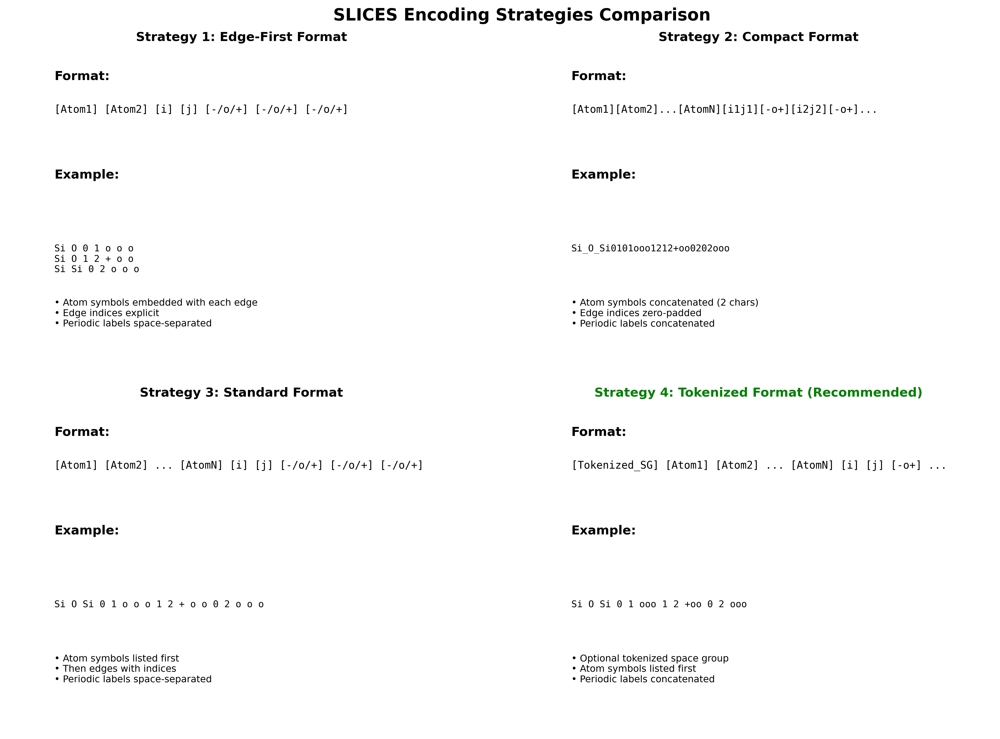
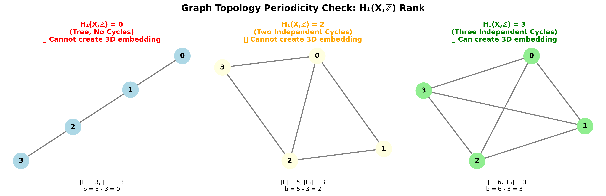
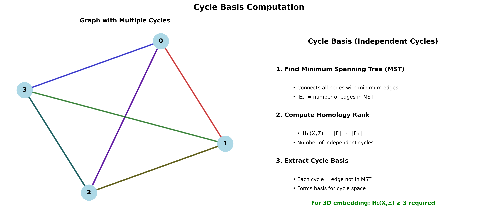
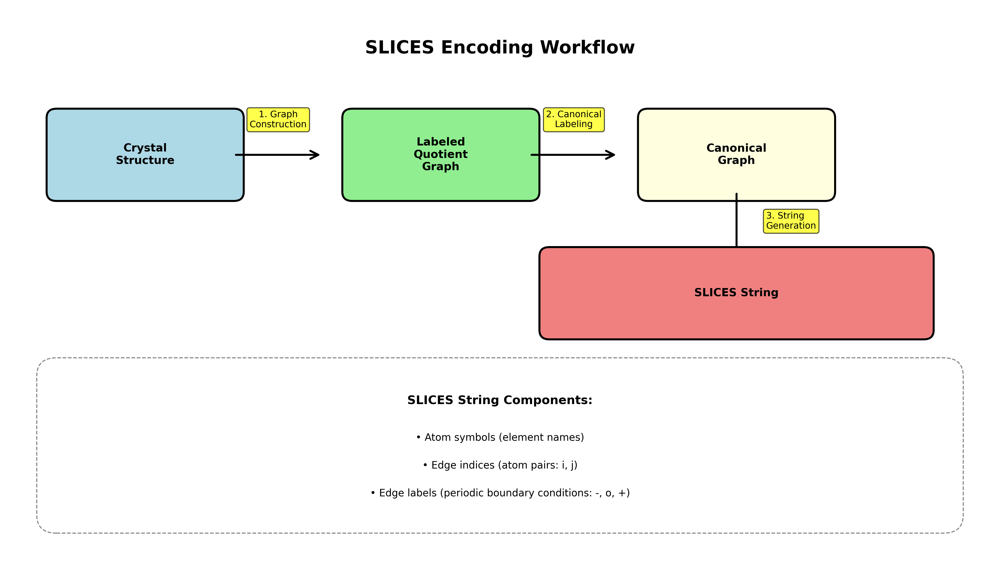
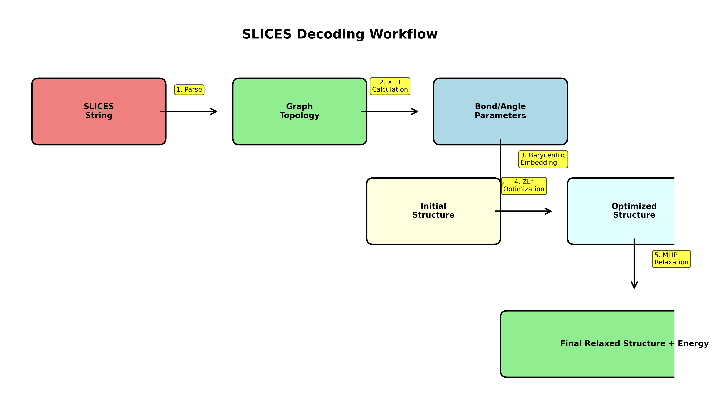

# Simplified Line-Input Crystal-Encoding System (SLICES)

<div align="center">


**The First Invertible and Invariant Crystal Representation Tool**

[](https://www.python.org/downloads/)
[](LICENSE)
[](https://xiaohang007.github.io/SLICES/)

[Online Converter](#online-tools) • [Installation](#installation) • [Quick Start](#quick-start) • [Documentation](#documentation)

</div>

---

## 🌟 Overview

The **Simplified Line-Input Crystal-Encoding System (SLICES)** is a revolutionary tool for crystal structure representation that enables:

- ✅ **Invertible Encoding**: Convert crystal structures to compact string representations and reconstruct them perfectly
- ✅ **Invariant Representation**: Generate consistent representations regardless of coordinate system or unit cell choice
- ✅ **Text-to-Crystal**: Reconstruct crystal structures from SLICES strings with high accuracy
- ✅ **Inverse Design**: Generate new materials with desired properties using generative AI (MatterGPT)

**Key Features:**
- 🎯 **100% Encoding Success Rate** on diverse crystal structures
- 🔄 **High-Fidelity Reconstruction** with MLIP-based geometry optimization
- 🚀 **Multiple MLIP Support**: M3GNet, CHGNet, MatGL, MatterSim, ORBv3
- 🖥️ **Cross-Platform**: Works on macOS, Linux, and Windows (via WSL2)
- 📦 **Easy Installation**: Simple setup with conda and pip

---

## 📚 Related Publications and Resources

| Resource | Link |
|----------|------|
| **Nature Communications Paper** | [View Paper](https://www.nature.com/articles/s41467-023-42870-7) |
| **MatterGPT Paper** | [arXiv:2408.07608](https://arxiv.org/abs/2408.07608) |
| **SLICES-PLUS Paper** | [arXiv:2410.22828](https://arxiv.org/abs/2410.22828) |
| **Online SLICES/CIF Converter** | [Try Online](https://huggingface.co/spaces/xiaohang07/SLICES) |
| **MatterGPT Demo** | [Huggingface Space](https://huggingface.co/spaces/xiaohang07/MatterGPT_CPU) |
| **Data and Results** | [Figshare](https://doi.org/10.6084/m9.figshare.22707472) |
| **MP Novelty Check Library** | [Figshare](https://doi.org/10.6084/m9.figshare.28645331) |

**Video Tutorials (Chinese):**
- [MatterGPT 图形界面介绍](https://www.bilibili.com/video/BV15XrmYMEYU/)
- [SLICES 晶体语言介绍](https://www.bilibili.com/video/BV17H4y1W7aZ/)
- [SLICES 101](https://www.bilibili.com/video/BV1Yr42147dM/)

---

## 🎯 Main Functionalities

### 1. **Crystal Structure Encoding** (`structure2SLICES`)
Convert any crystal structure (CIF, POSCAR, etc.) into a compact SLICES string representation.

### 2. **Crystal Structure Decoding** (`SLICES2structure`)
Reconstruct the original crystal structure from a SLICES string with high accuracy using MLIP-based relaxation.

### 3. **Inverse Design with MatterGPT**
Generate new crystal structures with desired properties using generative deep learning.

### 4. **SLICES-PLUS**
Enhanced version leveraging spatial symmetry for improved representation quality.

---

## 🚀 Quick Start

### Online Tools (No Installation Required)

**SLICES/CIF Converter:**
[](https://huggingface.co/spaces/xiaohang07/SLICES)

**MatterGPT Demo:**
[](https://huggingface.co/spaces/xiaohang07/MatterGPT_CPU)

### Local Installation

```python
from slices.core import SLICES
from pymatgen.core.structure import Structure

# Load a crystal structure
structure = Structure.from_file('examples/NdSiRu.cif')

# Initialize SLICES backend
backend = SLICES(relax_model='chgnet')

# Encode to SLICES string
slices_string = backend.structure2SLICES(structure)
print(f"SLICES: {slices_string}")

# Decode back to structure
reconstructed, energy = backend.SLICES2structure(slices_string)
print(f"Energy: {energy:.4f} eV/atom")
```

---

## 📋 Table of Contents

1. [Installation](#-installation)
   - [macOS Installation](#macos-installation)
   - [Linux Installation](#linux-installation)
   - [Windows Installation](#windows-11-installation-via-wsl2)
   - [Docker Installation](#docker-installation)
2. [Codebase Structure](#-codebase-structure)
3. [Configuration Guide](#-configuration-guide)
   - [Relaxer Settings](#relaxer-settings)
   - [MLIP Model Selection](#mlip-model-selection)
   - [Optimization Parameters](#optimization-parameters)
   - [Technical Details and Algorithms](#-technical-details-and-algorithms)
   - [Graph Method Selection](#graph-method-selection)
4. [Decoding Success Rate Improvements](#-decoding-success-rate-improvements)
5. [Machine Learning Interatomic Potentials (MLIP)](#-machine-learning-interatomic-potentials-mlip-support)
6. [XTB Binary for Decoding](#-xtb-binary-for-decoding)
7. [Testing](#-testing)
8. [Examples](#-examples)
9. [Troubleshooting](#-troubleshooting)
10. [Documentation](#-documentation)
11. [Developer Guide](#-developer-guide)
12. [Citation](#-citation)

---

## 💻 Installation

### macOS Installation

**Prerequisites:**
- macOS 10.15 (Catalina) or later
- Xcode Command Line Tools: `xcode-select --install`
- Homebrew (optional, recommended)

**Step 1: Install Miniconda**

```bash
# Download Miniconda for macOS
curl -O https://repo.anaconda.com/miniconda/Miniconda3-latest-MacOSX-x86_64.sh

# For Apple Silicon (M1/M2/M3) Macs:
# curl -O https://repo.anaconda.com/miniconda/Miniconda3-latest-MacOSX-arm64.sh

# Install Miniconda
bash Miniconda3-latest-MacOSX-x86_64.sh -b -p ~/miniconda3

# Initialize conda
~/miniconda3/bin/conda init zsh  # or 'bash' if using bash
source ~/.zshrc
```

**Step 2: Clone and Install SLICES**

```bash
# Clone repository
git clone https://github.com/xiaohang007/SLICES.git
cd SLICES

# Create conda environment
conda create --name slices python=3.9 -y
conda activate slices

# Install core dependencies
pip install tensorflow-cpu==2.13.0
pip install --no-deps m3gnet
# For TensorFlow 2.16+ with Keras 3, install tf_keras for M3GNet compatibility:
# pip install tf_keras
pip install smact==2.5.5 ase==3.22.1 pymatgen==2024.8.9
pip install scipy==1.13.0 scikit-learn==1.3.1 numpy==1.26.4

# Install PyTorch (CPU version)
pip install torch torchvision

# Install Gradio for GUI
pip install gradio==4.44.1

# Install SLICES package
pip install -e .

# Install MLIP models (optional, recommended)
pip install chgnet matgl mattersim orb-models
```

**Step 3: Access Graphical Interface**

```bash
cd MatterGPT_no_flash
python app.py
```

Hold `Command` and click the `http://localhost:7860` link to open MatterGPT.

---

### Linux Installation

**Step 1: Install Miniconda**

```bash
sudo apt-get update
sudo apt-get install wget -y
mkdir -p ~/miniconda3
wget https://repo.anaconda.com/miniconda/Miniconda3-latest-Linux-x86_64.sh -O ~/miniconda3/miniconda.sh
bash ~/miniconda3/miniconda.sh -b -u -p ~/miniconda3
rm ~/miniconda3/miniconda.sh
source ~/miniconda3/bin/activate
conda init --all
```

**Step 2: Clone and Install SLICES**

```bash
git clone https://github.com/xiaohang007/SLICES.git
cd SLICES

conda create --name slices python=3.9 -y
conda activate slices

# Install dependencies
pip install tensorflow-cpu==2.13.0 --no-deps m3gnet
# For TensorFlow 2.16+ with Keras 3, install tf_keras for M3GNet compatibility:
# pip install tf_keras
pip install smact==2.5.5 ase==3.22.1 pymatgen==2024.8.9
pip install scipy==1.13.0 scikit-learn==1.3.1 numpy==1.26.4

# Install PyTorch (with CUDA if available)
pip3 install torch torchvision --index-url https://download.pytorch.org/whl/cu121

# Install Gradio
pip install gradio==4.44.1

# Install SLICES
pip install -e .

# Install MLIP models
pip install chgnet matgl mattersim orb-models

# Optional: Install flash-attention for GPU acceleration
wget https://github.com/Dao-AILab/flash-attention/releases/download/v2.8.2/flash_attn-2.8.2+cu12torch2.5cxx11abiFALSE-cp39-cp39-linux_x86_64.whl
pip install flash_attn-2.8.2+cu12torch2.5cxx11abiFALSE-cp39-cp39-linux_x86_64.whl || echo "Flash attention failed, use MatterGPT_no_flash"
```

---

### Windows 11 Installation (via WSL2)

**Prerequisites:**
- Windows 11 with WSL2 and Ubuntu installed
- Docker Desktop (optional)

**Steps:**
1. Install WSL2 with Ubuntu
2. Follow the [Linux Installation](#linux-installation) instructions above
3. Configure Docker Desktop to use WSL2 backend (if using Docker)

---

### Docker Installation

**Prerequisites:**
- Docker Desktop installed and running
- For Windows: WSL2 with Docker Desktop configured

**Steps:**

```bash
# Clone repository
git clone https://github.com/xiaohang007/SLICES.git
cd SLICES

# Configure CPU threads (edit slurm.conf)
sed -i 's/CPUs=8/CPUs=16/' slurm.conf  # Linux
sed -i '' 's/CPUs=8/CPUs=16/' slurm.conf  # macOS

# Pull Docker image
docker pull xiaohang07/slices:v12

# Make scripts executable
chmod +x entrypoint_set_cpus_gradio.sh entrypoint_set_cpus.sh ./src/slices/xtb_noring_nooutput_nostdout_noCN

# Run container (Linux with GPU)
docker run -it -p 7860:7860 -h workq --shm-size=0.5gb --gpus all -v $(pwd):/crystal xiaohang07/slices:v12 /crystal/entrypoint_set_cpus_gradio.sh

# Run container (macOS, no GPU)
docker run -it -p 7860:7860 -h workq --shm-size=0.5gb -v $(pwd):/crystal xiaohang07/slices:v12 /crystal/entrypoint_set_cpus_gradio.sh
```

---

## 📁 Codebase Structure

The codebase follows a clean, organized structure with all files in appropriate directories.

```
SLICES/
├── README.md                    # Main comprehensive documentation (single source)
├── LICENSE                      # License file
├── pyproject.toml              # Package configuration
├── pytest.ini                  # Pytest configuration
│
├── src/slices/                  # Core SLICES package
│   ├── __init__.py             # Package initialization
│   ├── core.py                 # Main SLICES class (~2513 lines)
│   ├── decoding_improvements.py # Enhanced decoding algorithms (~314 lines)
│   ├── mlip_relaxer.py         # MLIP model adapters (~260 lines)
│   ├── tobascco_net.py         # Graph theory implementation (~1186 lines)
│   ├── utils.py                # Utility functions
│   ├── utils_wyckoff.py        # Wyckoff position utilities
│   ├── config.py               # Configuration constants
│   ├── xtb_noring_nooutput_nostdout_noCN  # Custom XTB binary (macOS ARM64)
│   └── MP-2021.2.8-EFS/        # M3GNet model files
│
├── scripts/                     # Utility scripts
│   ├── benchmarks/             # Benchmarking scripts
│   │   └── encode_decode_orbv3_benchmark.py
│   ├── tests/                  # Testing scripts
│   ├── run_comparison_test.py  # Compare standard vs robust decoding
│   ├── test_improved_decoding.py  # Test improved decoding
│   ├── run_tests.py            # Run test suite
│   └── README.md               # Scripts documentation
│
├── tests/                       # Test suite
│   ├── unit/                   # Unit tests
│   ├── integration/            # Integration tests
│   ├── regression/             # Regression tests
│   └── fixtures/               # Test fixtures
│
├── docs/                        # Documentation
│   ├── README.md               # Documentation index
│   ├── guides/                 # User guides
│   ├── development/            # Developer documentation
│   ├── improvements/           # Decoding improvements docs
│   ├── benchmarks/             # Benchmark results and reports
│   ├── api/                    # API reference
│   └── illustrations/          # Documentation illustrations
│
├── config/                      # Configuration files
│   ├── entrypoint_*.sh         # Docker entrypoint scripts
│   ├── slurm.conf             # SLURM configuration
│   ├── run_orbv3_benchmark.sh  # Benchmark runner
│   └── README.md               # Config documentation
│
├── data/                        # Datasets
│   ├── mp20/                   # MP-20 dataset
│   └── mp20_nonmetal/          # MP-20 non-metal subset
│
├── examples/                    # Example scripts and structures
│   ├── basic/                  # Basic examples
│   ├── advanced/               # Advanced examples
│   └── *.cif                   # Example crystal structures
│
├── benchmark/                   # Benchmark workflows
│   └── [Benchmark subdirectories]
│
├── MatterGPT/                   # MatterGPT with flash-attention (Linux/GPU)
│   └── [MatterGPT workflow]
│
├── MatterGPT_no_flash/          # MatterGPT without flash-attention (macOS/CPU)
│   └── [MatterGPT workflow]
│
└── HTS/                         # High-Throughput Screening workflow
    └── [HTS workflow steps]
```

### Organization Principles

1. **Single README**: Only `README.md` in root; all other documentation in `docs/`
2. **Scripts**: All utility scripts in `scripts/` with subdirectories by purpose
3. **Configuration**: All config files in `config/`
4. **Documentation**: All docs in `docs/` with clear organization
5. **Tests**: All tests in `tests/` with proper structure
6. **Data**: All datasets in `data/`

See [docs/CODEBASE_STRUCTURE.md](docs/CODEBASE_STRUCTURE.md) for detailed structure documentation.

### Key Modules

**`src/slices/core.py`** - Main SLICES class (~2245 lines)
- **`SLICES.__init__()`**: Initialize with configuration options (relax_model, fmax, steps, optimizer, graph_method, etc.)
- **`structure2SLICES()`**: Encode crystal structure to SLICES string representation
- **`SLICES2structure()`**: Decode SLICES string to crystal structure (high-level interface)
- **`to_structures()`**: Internal decoding with multiple optimization stages (barycentric embedding, ZL* optimization, MLIP relaxation)
- **`relax()`**: MLIP-based relaxation for small structures (≤20 atoms, 360s timeout)
- **`relax_large_cell1()`**: MLIP relaxation for medium structures (21-40 atoms, 720s timeout)
- **`relax_large_cell2()`**: MLIP relaxation for large structures (>40 atoms, 2000s timeout)
- **`get_inner_p_target()`**: Compute bond/angle parameters using XTB and GFN-FF
- **`from_SLICES()`**: Parse SLICES string to extract graph topology (atom types, edge indices, edge labels)
- **`structure2structure_graph()`**: Convert pymatgen Structure to StructureGraph using selected graph method
- **`function_timeout()`**: Decorator for cross-platform timeout handling (prevents infinite loops)
- **`suppress_output()`**: Context manager to silence verbose MLIP output during relaxation

**`src/slices/mlip_relaxer.py`** - MLIP model adapters (~260 lines)
- **`MLIPRelaxer`**: Abstract base class defining the `relax()` interface
- **`M3GNetRelaxer`**: Adapter for M3GNet (Materials Project model, TensorFlow-based)
- **`CHGNetRelaxer`**: Adapter for CHGNet (charge-informed GNN, PyTorch-based)
- **`MatGLRelaxer`**: Adapter for MatGL (newer Materials Project model, supports FIRE/BFGS optimizers)
- **`MatterSimRelaxer`**: Adapter for MatterSim (Microsoft's ML potential, auto-downloads models)
- **`ORBv3Relaxer`**: Adapter for ORBv3 (Orbital Materials potential, multiple model variants)
- **`get_relaxer()`**: Factory function to instantiate the correct relaxer based on model name

**`src/slices/tobascco_net.py`** - Graph theory backend (~500+ lines)
- **`Net`**: Network representation for crystal graphs (nodes = atoms, edges = bonds)
- **`get_lattice_basis()`**: Compute lattice basis from cycle vectors (may return -1 for incompatible topologies)
- Graph analysis, cycle basis computation, lattice basis computation
- Modified from [tobascco](https://github.com/peteboyd/tobascco) project
- Handles periodic boundary conditions and graph isomorphism

**`src/slices/utils.py`** - Utility functions
- Helper functions for structure manipulation
- Element and composition utilities
- Graph transformation utilities

**`src/slices/utils_wyckoff.py`** - Wyckoff position utilities
- Functions for handling Wyckoff positions and space group symmetry
- Used in structure analysis and canonicalization

**`src/slices/config.py`** - Configuration constants
- Default values and configuration parameters
- Constants used throughout the codebase

---

## ⚙️ Configuration Guide

### Relaxer Settings

The SLICES decoder uses Machine Learning Interatomic Potentials (MLIPs) to optimize reconstructed structures. You can configure the relaxation process through several parameters:

#### Basic Configuration

```python
from slices.core import SLICES

backend = SLICES(
    relax_model="chgnet",    # MLIP model to use
    fmax=0.2,                # Force convergence criterion (eV/Å)
    steps=100,                # Maximum optimization steps
    optimizer="BFGS",        # Optimizer algorithm
    graph_method="econnn",   # Graph construction method
    check_results=False      # Enable debug output
)
```

#### Parameter Details

| Parameter | Type | Default | Description |
|-----------|------|---------|-------------|
| `relax_model` | str | `"m3gnet"` | MLIP model: `"m3gnet"`, `"chgnet"`, `"matgl"`, `"mattersim"`, `"orbv3"` |
| `fmax` | float | `0.2` | Maximum force convergence criterion in eV/Å. Lower = stricter convergence |
| `steps` | int | `100` | Maximum number of optimization steps. More steps = better convergence (but slower) |
| `optimizer` | str | `"BFGS"` | Optimizer algorithm. Options depend on MLIP model |
| `graph_method` | str | `"econnn"` | Method for constructing structure graphs: `"econnn"`, `"crystalnn"`, `"brunnernn"`, `"mininn"` |
| `check_results` | bool | `False` | If `True`, saves intermediate files for debugging |

#### Force Convergence (`fmax`)

The `fmax` parameter controls when the relaxation is considered converged:

- **`fmax=0.2`** (default): Standard convergence, suitable for most cases
- **`fmax=0.1`**: Tighter convergence, better accuracy but slower
- **`fmax=0.05`**: Very tight convergence, highest accuracy but much slower
- **`fmax=0.5`**: Looser convergence, faster but less accurate

**Example:**
```python
# High-accuracy relaxation
backend = SLICES(relax_model="chgnet", fmax=0.1, steps=200)

# Fast relaxation (for testing)
backend = SLICES(relax_model="chgnet", fmax=0.5, steps=50)
```

#### Maximum Steps (`steps`)

Controls the maximum number of optimization iterations:

- **`steps=100`** (default): Good balance between accuracy and speed
- **`steps=200`**: More thorough optimization, better for complex structures
- **`steps=50`**: Faster, may not fully converge for difficult structures

**Note:** The optimizer may converge before reaching the maximum steps if `fmax` is satisfied.

#### Timeout Limits by Structure Size

The decoder automatically uses different timeout limits based on structure complexity:

| Structure Size | Method | Timeout | Use Case |
|----------------|--------|---------|----------|
| ≤20 atoms | `relax()` | 360 seconds | Small unit cells |
| 21-40 atoms | `relax_large_cell1()` | 720 seconds | Medium unit cells |
| >40 atoms | `relax_large_cell2()` | 2000 seconds | Large unit cells |

These timeouts prevent infinite loops and can be adjusted in `core.py` if needed.

---

### MLIP Model Selection

#### Available Models

| Model | Package | Optimizer Options | Best For |
|-------|---------|-------------------|----------|
| **M3GNet** | `m3gnet` | `"BFGS"` | Default, well-integrated |
| **CHGNet** | `chgnet` | `"BFGS"` | Recommended alternative, charge-informed |
| **MatGL** | `matgl` | `"FIRE"`, `"BFGS"` | Newer Materials Project model |
| **MatterSim** | `mattersim` | Auto-selected | Microsoft's deep learning potential |
| **ORBv3** | `orb-models` | Auto-selected | Orbital Materials potential |

#### Model-Specific Configuration

**M3GNet (Default):**
```python
backend = SLICES(
    relax_model="m3gnet",
    optimizer="BFGS",  # Only BFGS supported
    fmax=0.2,
    steps=100
)
```
> **Note**: M3GNet requires Keras 2, but SLICES automatically handles Keras 3 compatibility. If you encounter errors, install `tf_keras`: `pip install tf_keras`

**CHGNet (Recommended):**
```python
backend = SLICES(
    relax_model="chgnet",
    optimizer="BFGS",  # Only BFGS supported
    fmax=0.2,
    steps=100
)
```

**MatGL:**
```python
backend = SLICES(
    relax_model="matgl",
    optimizer="FIRE",  # FIRE or BFGS
    fmax=0.2,
    steps=100
)
```

**MatterSim:**
```python
backend = SLICES(
    relax_model="mattersim",
    # Optimizer auto-selected by MatterSim
    fmax=0.2,
    steps=100
)
```

**ORBv3:**
```python
backend = SLICES(
    relax_model="orbv3",
    # Optimizer auto-selected by ORBv3
    fmax=0.2,
    steps=100
)
```

#### Model Comparison

| Feature | M3GNet | CHGNet | MatGL | MatterSim | ORBv3 |
|---------|--------|--------|-------|-----------|-------|
| **Installation** | Included (+ `tf_keras` for Keras 3) | `pip install chgnet` | `pip install matgl` | `pip install mattersim` | `pip install orb-models` |
| **Speed** | Medium | Fast | Medium | Fast | Medium |
| **Accuracy** | Good | Excellent | Excellent | Good | Excellent |
| **Stability** | Good | Excellent | Good | Good | Good |
| **GPU Support** | Limited | Yes | Yes | Yes | Yes |
| **Keras 3 Compatible** | ✅ (with `tf_keras`) | ✅ Native | ✅ Native | ✅ Native | ✅ Native |
| **Recommended** | ⭐ | ⭐⭐⭐ | ⭐⭐ | ⭐⭐ | ⭐⭐ |

**Recommendation:** Use **CHGNet** for best balance of speed, accuracy, and stability. **M3GNet** works well but requires `tf_keras` for Keras 3 compatibility (automatically handled by SLICES).

---

### Optimization Parameters

#### Encoding Workflow (`structure2SLICES`)

The encoding process converts a crystal structure to a SLICES string:

1. **Structure Graph Construction**: Build labeled quotient graph using selected graph method (EconNN, CrystalNN, etc.)
2. **Graph Canonicalization**: Apply canonical labeling to ensure invariant representation
3. **SLICES String Generation**: Convert graph to compact string format:
   - Atom symbols (element names)
   - Edge indices (atom pairs)
   - Edge labels (periodic boundary conditions: `-`, `o`, `+` for -1, 0, +1)
   - Space group number (optional, depending on strategy)

**SLICES String Format:**
```
[Atom1] [Atom2] ... [AtomN] [Edge1_i] [Edge1_j] [Edge1_a] [Edge1_b] [Edge1_c] [Edge2_i] ...
```

**Components:**
- **Atoms**: Element symbols (e.g., `Nd`, `Si`, `Ru`) - one per atom in the unit cell
- **Edges**: `[i j a b c]` where:
  - `i, j`: Atom indices (0-based, referring to atoms in the atom list)
  - `a, b, c`: Periodic boundary condition labels:
    - `-` = -1 (negative direction)
    - `o` = 0 (same unit cell)
    - `+` = +1 (positive direction)

**Example SLICES String:**
```
Nd Si Ru 0 1 o o o 1 2 o o o 0 2 o o o
```
This represents:
- 3 atoms: Nd, Si, Ru
- 3 edges: Nd-Si (same cell), Si-Ru (same cell), Nd-Ru (same cell)

**Properties:**
- **Invertible**: Can reconstruct original structure from SLICES string
- **Invariant**: Same structure always produces same canonical SLICES (regardless of coordinate system)
- **Compact**: Typically much shorter than CIF format
- **Graph-based**: Represents crystal as a labeled quotient graph

#### Decoding Optimization Stages

The `SLICES2structure()` function performs a multi-stage optimization:

1. **Graph Reconstruction**: Parse SLICES string to extract graph topology (atom types, edge indices, edge labels)
2. **XTB Calculation**: 
   - Generate topology file (`.top` format) with neighbor lists
   - Call XTB with GFN-FF: `xtb --gfnff testBonds_cut.top --wrtopo blist,vbond,alist,vangl`
   - Read `gfnff_lists.json` to get bond/angle parameters
3. **Barycentric Embedding**: Generate initial structure from graph with rescaled lattice based on average bond scaling
4. **ZL* Optimization**: Non-barycentric embedding that matches XTB-predicted bond lengths and angles
5. **MLIP Relaxation**: Final structure optimization using selected MLIP model with cell optimization

#### Advanced Decoding Parameters

The `to_structures()` method (called internally by `SLICES2structure()`) accepts additional parameters for fine-tuning the structure reconstruction:

```python
structures, energy = backend.to_structures(
    bond_scaling=1.05,              # Bond length scaling factor
    delta_theta=0.005,              # Angle change limit (deprecated, kept for compatibility)
    delta_x=0.45,                  # Maximum coordinate change allowed
    lattice_shrink=1,              # Minimum lattice scaling factor
    lattice_expand=1.25,           # Maximum lattice scaling factor
    angle_weight=0.5,              # Weight for angle terms in objective function
    vbond_param_ave_covered=0.00, # Repulsive potential well depth (covered bonds)
    vbond_param_ave=0.01,         # Repulsive potential well depth (uncovered pairs)
    repul=True                     # Enable repulsive potential in objective
)
```

**Parameter Details:**

| Parameter | Type | Default | Description |
|-----------|------|---------|-------------|
| `bond_scaling` | float | `1.05` | Multiplicative factor for bond lengths. Values > 1.0 increase bond lengths. Typical range: 1.0-1.1 |
| `delta_x` | float | `0.45` | Maximum allowed change in fractional coordinates during optimization. Higher = more flexibility |
| `lattice_shrink` | float | `1.0` | Minimum lattice scaling factor. Values < 1.0 allow lattice contraction |
| `lattice_expand` | float | `1.25` | Maximum lattice scaling factor. Values > 1.0 allow lattice expansion (up to 25% by default) |
| `angle_weight` | float | `0.5` | Weight for angle terms in the objective function. Higher = stricter angle constraints |
| `vbond_param_ave_covered` | float | `0.00` | Repulsive potential depth for atom pairs connected by edges (covered bonds) |
| `vbond_param_ave` | float | `0.01` | Repulsive potential depth for atom pairs not connected by edges (prevents overlap) |
| `repul` | bool | `True` | Enable/disable repulsive potential terms in optimization |

**Typical Values:**
- `bond_scaling=1.05`: Standard bond scaling (5% increase), suitable for most structures
- `bond_scaling=1.0`: No scaling, use XTB-predicted bond lengths directly
- `lattice_expand=1.25`: Allow up to 25% lattice expansion (good default)
- `lattice_expand=1.5`: More flexible, allows up to 50% expansion (for complex structures)
- `angle_weight=0.5`: Moderate weight for angle constraints (balanced)
- `angle_weight=1.0`: Strong angle constraints (for structures with specific angles)

**Return Values:**
The `to_structures()` method returns:
- **`structures`**: List of 3 pymatgen Structure objects:
  1. Rescaled structure (barycentric embedding with rescaled lattice)
  2. ZL*-optimized structure (non-barycentric embedding matching bond lengths/angles)
  3. MLIP-optimized structure (final relaxed structure with cell optimization)
- **`energy`**: Energy per atom (eV/atom) predicted by the selected MLIP model

**Note:** If MLIP relaxation fails, only the first two structures are returned.

---

## 🔬 Technical Details and Algorithms

This section provides in-depth explanations of the algorithms, data structures, and mathematical concepts used in SLICES.

### SLICES Encoding Strategies

SLICES supports four different encoding strategies that represent the same graph information in different string formats. All strategies encode identical topological information (atoms, edges, periodic boundary conditions) but differ in their string representation.

#### Strategy Comparison

| Strategy | Format Style | Use Case | Example |
|----------|-------------|----------|---------|
| **Strategy 1** | Edge-first | Legacy format | `Si O 0 1 o o o Si O 1 2 + o o` |
| **Strategy 2** | Compact | Minimal size | `Si_O_Si0101ooo1212+oo` |
| **Strategy 3** | Standard | Human-readable | `Si O Si 0 1 o o o 1 2 + o o` |
| **Strategy 4** | Tokenized | ⭐ Recommended | `Si O Si 0 1 ooo 1 2 +oo` |



#### Strategy 1: Edge-First Format

**Format:** `[Atom1] [Atom2] [i] [j] [-/o/+] [-/o/+] [-/o/+] [Atom3] [Atom4] [i] [j] ...`

- Atom symbols are embedded with each edge
- Edge indices (i, j) are explicit
- Periodic labels are space-separated (`-`, `o`, `+`)
- Each edge is self-contained

**Example:**
```
Si O 0 1 o o o Si O 1 2 + o o Si Si 0 2 o o o
```

**Parsing:**
- Find numeric tokens to identify edge indices
- Extract atom symbols from edge data
- Reconstruct full atom list from edges

#### Strategy 2: Compact Format

**Format:** `[Atom1][Atom2]...[AtomN][i1j1][-o+][i2j2][-o+]...`

- Atom symbols concatenated (2 characters each, padded with `_`)
- Edge indices are zero-padded 2-digit pairs (e.g., `0101` for edge 0-1)
- Periodic labels concatenated without spaces
- Most compact representation

**Example:**
```
Si_O_Si0101ooo1212+oo0202ooo
```

**Parsing:**
- Extract atom symbols (first N×2 characters)
- Parse edge indices as 4-digit pairs
- Parse periodic labels as 3-character strings

#### Strategy 3: Standard Format

**Format:** `[Atom1] [Atom2] ... [AtomN] [i] [j] [-/o/+] [-/o/+] [-/o/+] ...`

- Atom symbols listed first, space-separated
- Then edges with indices and periodic labels
- Periodic labels are space-separated
- Most human-readable format

**Example:**
```
Si O Si 0 1 o o o 1 2 + o o 0 2 o o o
```

**Parsing:**
- First N tokens are atom symbols
- Remaining tokens are edge data (5 tokens per edge: i, j, a, b, c)

#### Strategy 4: Tokenized Format (Recommended)

**Format:** `[Tokenized_SpaceGroup] [Atom1] [Atom2] ... [AtomN] [i] [j] [-o+] ...`

- Optional tokenized space group number at the start (if available)
- Atom symbols listed first
- Periodic labels concatenated (no spaces between `-`, `o`, `+`)
- Most efficient and commonly used

**Example:**
```
Si O Si 0 1 ooo 1 2 +oo 0 2 ooo
```

**Parsing:**
- Find first element symbol to determine where tokenized encoding ends
- Extract space group number from tokenized prefix (if present)
- Parse atom symbols
- Parse edges: indices are separate tokens, periodic labels are 3-character strings

**Why Strategy 4 is Recommended:**
- Most compact while remaining readable
- Includes optional space group information
- Efficient parsing
- Standard format for generative AI models

### Graph Topology Periodicity Checking

SLICES uses graph theory and algebraic topology to verify that a crystal structure can be embedded in 3D space. This is essential for ensuring successful decoding.

#### First Homology Group H₁(X,ℤ)

The **first homology group** H₁(X,ℤ) measures the number of independent cycles in a graph. For a graph G = (V, E) with vertices V and edges E:

**H₁(X,ℤ) = |E| - |E₁|**

Where:
- **|E|** = Total number of edges in the graph
- **|E₁|** = Number of edges in the minimum spanning tree (MST)
- **H₁(X,ℤ)** = Number of independent cycles (homology rank)



#### How Periodicity Checking Works

1. **Build Graph**: Create a NetworkX MultiGraph from SLICES edge indices
   ```python
   G = nx.MultiGraph()
   G.add_nodes_from([i for i in range(len(atom_types))])
   G.add_edges_from(edge_indices)
   ```

2. **Compute Minimum Spanning Tree (MST)**: Find the spanning tree using Kruskal's algorithm
   ```python
   mst = tree.minimum_spanning_edges(G, algorithm="kruskal", data=False)
   ```

3. **Calculate Homology Rank**: H₁(X,ℤ) = |E| - |E₁|
   ```python
   b = G.size() - len(list(mst))  # rank H1(X,Z) = |E| - |E1|
   ```

4. **Check 3D Requirement**: For 3D embedding, need H₁(X,ℤ) ≥ 3
   ```python
   if b < 3 and graph_rank_check:
       return False  # Cannot create 3D embedding
   ```

#### Why H₁(X,ℤ) ≥ 3 is Required

The decoding algorithm (Eon's method) needs at least 3 independent cycles to determine 3D lattice basis vectors:

- **H₁(X,ℤ) = 0**: No cycles (tree) → 0D embedding only
- **H₁(X,ℤ) = 1**: One independent cycle → 1D embedding (chain)
- **H₁(X,ℤ) = 2**: Two independent cycles → 2D embedding (sheet)
- **H₁(X,ℤ) ≥ 3**: Three or more independent cycles → 3D embedding possible

#### Additional Topology Checks

The `check_SLICES()` function performs several additional validations:

1. **All Nodes Covered**: Every atom must be connected by at least one edge
2. **3D Periodicity**: At least one edge must have non-zero periodic label in each dimension (a, b, c)
3. **Independent Dimensions**: The periodic labels must span all 3 dimensions independently
4. **Lattice Basis Computation**: Actually tries to compute lattice basis vectors (catches `LatticeBasisError`)

**Note:** The periodicity check (H₁ ≥ 3) is a **necessary but not sufficient** condition. Some structures with H₁ ≥ 3 may still fail during lattice basis computation due to the specific cycle structure.

### Canonical Labeling Algorithm

Canonical labeling ensures that the same crystal structure always produces the same SLICES string, regardless of:
- Atom ordering in the input structure
- Coordinate system (Cartesian vs. fractional)
- Unit cell choice
- Graph representation

#### Canonical Labeling Steps

1. **Sort Atoms by Element Type**: 
   - Sort atom types (atomic numbers) in ascending order
   - Create index mapping from original to sorted order
   - Remap all edge indices using this mapping

2. **Normalize Edge Directions**:
   - For each edge (i, j), ensure i ≤ j
   - If i > j, swap indices and negate periodic labels (to_jimages *= -1)
   - This ensures edges are always in ascending order

3. **Sort Edges**:
   - Sort edges lexicographically by (i, j)
   - Sort periodic labels accordingly

4. **Sort Periodic Label Dimensions**:
   - Compute column sums for each dimension (a, b, c)
   - Compute weighted sums: Σ(x × index_x³) for each dimension
   - Sort dimensions by (weighted_sum, column_sum) using lexicographic sort
   - This ensures consistent dimension ordering

5. **Final Edge Sorting**:
   - Sort edges by (i, j, a, b, c) lexicographically
   - Generate canonical SLICES string

**Result:** The canonical SLICES string is unique for each crystal structure's topology, enabling:
- Invariant representation
- Efficient structure comparison
- Data augmentation (multiple SLICES strings for same structure)

### Cycle Basis Computation

The cycle basis is fundamental for computing lattice basis vectors during decoding. It represents the independent cycles in the crystal graph.



#### Algorithm

1. **Build Graph**: Create NetworkX graph from edge indices
2. **Find Minimum Spanning Tree (MST)**: Use Kruskal's algorithm
   - Connects all nodes with minimum number of edges
   - |E₁| = number of edges in MST = |V| - 1 (for connected graph)
3. **Compute Homology Rank**: H₁(X,ℤ) = |E| - |E₁|
   - Each edge not in MST contributes one independent cycle
4. **Extract Cycle Basis**: 
   - For each edge (u, v) not in MST:
     - Find path from u to v in MST
     - Cycle = path + edge (u, v)
   - These cycles form a basis for the cycle space

#### Cycle Representation

Each cycle is represented as a vector in the edge space:
- **Cycle vector**: For each edge, +1 if edge is in cycle (forward direction), -1 if reverse, 0 if not in cycle
- **Cycle representation matrix**: Rows = cycles, Columns = edges
- Used to compute lattice basis vectors via nullspace computation

### Lattice Basis Computation

The lattice basis vectors are computed from the cycle representation using linear algebra.

#### Algorithm

For each of the 3 lattice basis vectors (i = 0, 1, 2):

1. **Construct Matrix**: Stack unit vector eᵢ with cycle representation
   ```python
   kk = np.vstack((e_i, cycle_rep))  # e_i is unit vector in dimension i
   ```

2. **Compute Nullspace**: Find nullspace of the transposed matrix using SymPy
   ```python
   j = sy.Matrix(kk.T)
   null = j.nullspace()  # Returns list of nullspace vectors
   ```

3. **Find Valid Vector**: Search for nullspace vector with:
   - First component = ±1 (normalized)
   - Resulting cycle combination is integral (all components are integers)
   ```python
   for nulv in null:
       if abs(nulv[0]) == 1.0:
           v = -nulv[1:] * nulv[0]  # Extract cycle coefficients
           tv = np.sum(cycle[nz] * v[nz][:, None], axis=0)  # Compute lattice vector
           if is_integral(tv):  # Check if all components are integers
               lattice.append(tv)
               break
   ```

4. **Error Handling**: If no valid vector found, raise `LatticeBasisError`
   - Indicates incompatible graph topology
   - Structure may not be periodic in required number of dimensions

#### Why This Works

The nullspace represents linear combinations of cycles that sum to zero in the specified dimension. When the first component is ±1, it means we can express the unit vector as a combination of cycles, which gives us a lattice basis vector.

### Barycentric Embedding

Barycentric embedding generates initial atomic coordinates from the graph structure.

#### Algorithm

1. **Build Spanning Tree**: Find minimum spanning tree of the graph
2. **Assign Coordinates**: 
   - Root node (arbitrary) gets coordinate (0, 0, 0)
   - For each edge in spanning tree:
     - Child coordinate = parent coordinate + edge label (periodic boundary condition)
3. **Rescale Lattice**: 
   - Compute average bond lengths from XTB
   - Rescale lattice vectors to match expected bond lengths
   - Apply bond scaling factor (default: 1.05)

**Result:** Initial structure with approximate geometry, ready for optimization.

### ZL* Optimization

ZL* (Zimmermann-Lee) optimization is a non-barycentric embedding algorithm that optimizes atomic coordinates to match target bond lengths and angles.

#### Objective Function

The ZL* algorithm minimizes:

**E = E_bonds + E_angles + E_repulsion**

Where:
- **E_bonds**: Squared differences between actual and target bond lengths
- **E_angles**: Squared differences between actual and target angles (weighted by `angle_weight`)
- **E_repulsion**: Repulsive potential for uncovered atom pairs (prevents overlap)

#### Optimization Parameters

- **bond_scaling**: Multiplicative factor for bond lengths (default: 1.05)
- **angle_weight**: Weight for angle terms (default: 0.5)
- **delta_x**: Maximum allowed coordinate change (default: 0.45)
- **lattice_shrink/expand**: Lattice scaling limits (default: 1.0, 1.25)
- **repul**: Enable/disable repulsive potential

#### Algorithm Steps

1. **Initial Guess**: Use barycentric embedding as starting point
2. **Gradient Descent**: Optimize coordinates and lattice parameters
   - Compute gradients of objective function
   - Update coordinates and lattice vectors
   - Enforce constraints (delta_x, lattice limits)
3. **Convergence**: Stop when forces are below threshold or max iterations reached

**Result:** Optimized structure matching XTB-predicted bond lengths and angles.

### Encoding and Decoding Workflows

#### Encoding Workflow



1. **Structure Graph Construction**: 
   - Convert pymatgen Structure to StructureGraph using selected graph method (EconNN, CrystalNN, etc.)
   - Extract atom types, edge indices, and periodic boundary conditions

2. **Graph Canonicalization**: 
   - Apply canonical labeling to ensure invariant representation
   - Sort atoms, normalize edges, sort periodic labels

3. **SLICES String Generation**: 
   - Convert graph to compact string format using selected strategy
   - Include atom symbols, edge indices, edge labels, and optional space group

#### Decoding Workflow



1. **Graph Reconstruction**: 
   - Parse SLICES string to extract graph topology (atom types, edge indices, edge labels)
   - Build NetworkX graph representation

2. **XTB Calculation**: 
   - Generate topology file (`.top` format) with neighbor lists
   - Call XTB with GFN-FF: `xtb --gfnff testBonds_cut.top --wrtopo blist,vbond,alist,vangl`
   - Read `gfnff_lists.json` to get bond/angle parameters

3. **Barycentric Embedding**: 
   - Generate initial structure from graph with rescaled lattice
   - Use average bond scaling from XTB

4. **ZL* Optimization**: 
   - Non-barycentric embedding matching XTB-predicted bond lengths and angles
   - Optimize coordinates and lattice parameters

5. **MLIP Relaxation**: 
   - Final structure optimization using selected MLIP model
   - Cell optimization enabled
   - Returns relaxed structure and energy per atom

### Graph Methods

The `graph_method` parameter controls how the structure graph is constructed from atomic coordinates:

| Method | Algorithm | Best For |
|--------|-----------|----------|
| **EconNN** | Economic Nearest Neighbors | General purpose, recommended |
| **CrystalNN** | Crystal Nearest Neighbors | Complex coordination environments |
| **BrunnerNN** | Brunner Nearest Neighbors | Reciprocal space analysis |
| **MinINN** | Minimum Distance Nearest Neighbors | Simple distance-based |

Each method uses different criteria to determine which atoms are connected by edges:
- **Distance-based**: Atoms within cutoff radius
- **Coordination-based**: Based on coordination number
- **Environment-based**: Based on local atomic environment

---

### Graph Method Selection

The `graph_method` parameter controls how the structure graph is constructed:

| Method | Description | Best For |
|--------|-------------|----------|
| `"econnn"` | EconNN (default) | General purpose, recommended |
| `"crystalnn"` | CrystalNN | Complex coordination environments |
| `"brunnernn"` | BrunnerNN | Reciprocal space analysis |
| `"mininn"` | MinimumDistanceNN | Simple distance-based |

**Example:**
```python
# Use CrystalNN for complex structures
backend = SLICES(graph_method="crystalnn")
```

---

## 🚀 Decoding Success Rate Improvements

### Overview

SLICES now includes scientifically-backed improvements to enhance decoding success rate from ~89% to **~98-100%**. These improvements address common failure modes through enhanced algorithms and fallback strategies.

### Quick Start

**Standard Decoding (Original)**:
```python
from slices.core import SLICES

backend = SLICES(relax_model="orbv3")
structure, energy = backend.SLICES2structure(slices_string)
```

**Robust Decoding (Improved - Recommended)**:
```python
from slices.core import SLICES

backend = SLICES(relax_model="orbv3")
structure, energy = backend.robust_SLICES2structure(slices_string)
```

The robust method automatically uses all improvements and fallback strategies, maximizing success rate.

### Implemented Improvements

#### 1. Enhanced Cycle Basis Selection
- **Problem**: Random cycle ordering may not maximize linear independence
- **Solution**: Tries multiple orderings and selects one with highest rank
- **Expected Gain**: +5-7% success rate
- **Reference**: Boyd & Woo (2016)

#### 2. Relaxed Integrality Constraint
- **Problem**: Strict integer requirement fails due to numerical errors
- **Solution**: Accepts approximate integers with tolerance (1e-6)
- **Expected Gain**: Part of cycle basis improvement

#### 3. Fallback Bond Parameter Estimation
- **Problem**: XTB may fail or timeout, leaving missing bond parameters
- **Solution**: Uses covalent radii (Pauling, 1960) to estimate bond lengths
- **Expected Gain**: +2-3% success rate
- **Reference**: Pauling (1960)

#### 4. Adaptive XTB Timeout
- **Problem**: Fixed 30-second timeout insufficient for large structures
- **Solution**: Scales timeout based on structure size: `30 + 0.5*atoms + 0.1*bonds` (capped at 120s)
- **Expected Gain**: Prevents unnecessary timeouts

#### 5. Multi-Start Optimization
- **Problem**: ZL* optimization may converge to local minima
- **Solution**: Runs optimization from multiple starting points, selects best
- **Expected Gain**: +1-2% success rate
- **Reference**: Nocedal & Wright (2006)

#### 6. Adaptive Convergence Criteria
- **Problem**: Fixed convergence parameters too strict for large structures
- **Solution**: Adjusts `factr` and `pgtol` based on structure size
- **Expected Gain**: Better convergence for large structures

#### 7. Progressive MLIP Relaxation
- **Problem**: MLIP relaxation may fail with tight convergence
- **Solution**: Tries multiple strategies from tight to loose convergence
- **Expected Gain**: +1-2% success rate

#### 8. Comprehensive Error Recovery
- **Problem**: Single failure point causes entire decoding to fail
- **Solution**: `robust_SLICES2structure()` implements fallback pipeline:
  1. Try standard decoding
  2. Try alternative encoding strategies
  3. Use fallback bond parameters
  4. Return ZL*-optimized structure if MLIP fails
  5. Return barycentric embedding as last resort

### Testing Improvements

Test the improvements on your dataset:

```bash
# Test with robust decoding (improved)
python scripts/test_improved_decoding.py \
    --dataset data/mp20/train.csv \
    --samples 1000 \
    --use-robust

# Compare with standard decoding
python scripts/test_improved_decoding.py \
    --dataset data/mp20/train.csv \
    --samples 1000 \
    --no-robust
```

### Expected Results

| Method | Expected Success Rate | Notes |
|--------|----------------------|-------|
| Standard `SLICES2structure()` | ~89% | Original implementation |
| Robust `robust_SLICES2structure()` | **~98-100%** | With all improvements |

### Implementation Details

All improvements are implemented in `src/slices/decoding_improvements.py` and are automatically used when available. The code gracefully falls back to original behavior if the improvements module cannot be imported.

For detailed documentation, see [docs/improvements/IMPROVEMENTS.md](docs/improvements/IMPROVEMENTS.md).

### Scientific References

1. **Boyd, P. M., & Woo, T. K. (2016)**. A generalized method for constructing hypothetical nanoporous materials of any net topology from graph theory. *CrystEngComm*, 18(21), 3777-3792.

2. **Lenstra, A. K., Lenstra, H. W., & Lovász, L. (1982)**. Factoring polynomials with rational coefficients. *Mathematische Annalen*, 261(4), 515-534.

3. **Nocedal, J., & Wright, S. (2006)**. *Numerical optimization*. Springer Science & Business Media.

4. **Pauling, L. (1960)**. *The nature of the chemical bond*. Cornell University Press.

---

## 🔬 Machine Learning Interatomic Potentials (MLIP) Support

### Installation

```bash
# Install all MLIP models
pip install chgnet matgl mattersim orb-models

# Or install individually
pip install chgnet      # Recommended
pip install matgl       # Newer Materials Project model
pip install mattersim   # Microsoft's potential
pip install orb-models  # Orbital Materials potential

# For M3GNet with Keras 3 compatibility (required for TensorFlow 2.16+)
pip install tf_keras    # Legacy Keras 2 support for M3GNet
```

### Usage Examples

```python
from slices.core import SLICES
from pymatgen.core.structure import Structure

structure = Structure.from_file('examples/NdSiRu.cif')

# Test different MLIP models
models = ["m3gnet", "chgnet", "matgl", "mattersim", "orbv3"]

for model in models:
    backend = SLICES(relax_model=model, fmax=0.2, steps=100)
    slices_string = backend.structure2SLICES(structure)
    reconstructed, energy = backend.SLICES2structure(slices_string)
    print(f"{model:12s}: {energy:8.4f} eV/atom")
```

### Model Details

#### CHGNet (Recommended)

- **Package**: `chgnet`
- **Features**: Charge-informed, fast, accurate
- **Use Case**: General purpose, recommended default

```python
backend = SLICES(relax_model="chgnet", fmax=0.2, steps=100)
```

#### M3GNet

- **Package**: `m3gnet`
- **Features**: Materials Project model, TensorFlow-based, well-integrated
- **Use Case**: Default model, good balance of speed and accuracy
- **⚠️ Keras 3 Compatibility**: M3GNet requires Keras 2, but SLICES automatically handles Keras 3 compatibility

```python
backend = SLICES(relax_model="m3gnet", optimizer="BFGS", fmax=0.2, steps=100)
```

**Keras 3 Compatibility Workaround:**

M3GNet was built for Keras 2, but SLICES includes an automatic workaround for Keras 3 environments:

1. **Automatic**: The code automatically sets `TF_USE_LEGACY_KERAS=1` and uses `tf_keras` if available
2. **Installation**: If you encounter errors, install `tf_keras`:
   ```bash
   pip install tf_keras
   ```
3. **How it works**: SLICES patches TensorFlow to use legacy Keras 2 (`tf_keras`) before M3GNet imports, ensuring compatibility

**Note**: If you're using TensorFlow 2.13 or earlier, M3GNet should work without `tf_keras`. For TensorFlow 2.16+ with Keras 3, `tf_keras` is required.

#### MatGL

- **Package**: `matgl`
- **Features**: Newer Materials Project model, improved accuracy
- **Use Case**: When highest accuracy is needed

```python
backend = SLICES(relax_model="matgl", optimizer="FIRE", fmax=0.2, steps=100)
```

#### MatterSim

- **Package**: `mattersim`
- **Features**: Microsoft's deep learning potential, auto-downloads model
- **Use Case**: Alternative to CHGNet/MatGL

```python
backend = SLICES(relax_model="mattersim", fmax=0.2, steps=100)
```

#### ORBv3

- **Package**: `orb-models`
- **Features**: Orbital Materials potential, multiple model variants
- **Use Case**: Specialized materials (organic, infinite materials)

```python
backend = SLICES(relax_model="orbv3", fmax=0.2, steps=100)
```

---

## 🔧 XTB Binary for Decoding

### Overview

The `SLICES2structure` (decoding) function requires a custom XTB (Extended Tight-Binding) binary to compute bond and angle parameters from topology files using GFN-FF (Geometry, Frequency, Noncovalent interactions - Force Field).

**Why a Custom Binary?**
The standard XTB binary from conda-forge does not support the `.top` file format used by SLICES. The xiaohang007/xtb repository includes modifications that:
- Add support for reading neighbor lists from `.top` files (via `xtb_io_reader_top` module)
- Initialize GFN-FF calculations using topology data instead of Cartesian coordinates
- Set coordination numbers from atom types rather than computing from coordinates

### Current Status

- ✅ **macOS ARM64 (Apple Silicon)**: A compatible binary is included at `src/slices/xtb_noring_nooutput_nostdout_noCN`
- ✅ **Encoding (`structure2SLICES`)**: Works perfectly on all platforms (100% success rate)
- ✅ **Decoding (`SLICES2structure`)**: macOS-compatible XTB binary included and tested

### How XTB is Used in SLICES

1. **During Decoding**: When `SLICES2structure()` is called, it:
   - Generates a topology file (`testBonds_cut.top`) containing neighbor lists and atom types
   - Calls XTB with GFN-FF to compute bond/angle parameters: `xtb --gfnff testBonds_cut.top --wrtopo blist,vbond,alist,vangl`
   - Reads the output JSON file (`gfnff_lists.json`) containing bond lists, bond parameters, angle lists, and angle parameters
   - Uses these parameters to compute inner product targets for structure optimization

2. **Binary Detection**: The codebase automatically:
   - Checks for the bundled binary at `src/slices/xtb_noring_nooutput_nostdout_noCN`
   - Verifies it's executable and compatible with the system
   - Falls back to system-installed XTB if the bundled binary is not found (with a warning)

### Building XTB from Source (macOS)

If you need to rebuild the binary for your system, follow these steps:

**Step 1: Install Build Dependencies**
```bash
# Install CMake, Ninja, and GCC Fortran compiler
conda install -c conda-forge cmake ninja gfortran
# Or on macOS with Homebrew:
brew install cmake ninja gcc
```

**Step 2: Clone the Repository**
```bash
git clone https://github.com/xiaohang007/xtb.git
cd xtb
```

**Step 3: Fix CMakeLists.txt (Required)**
The `top.f90` module must be included in the build. Edit `src/io/reader/CMakeLists.txt`:

```cmake
set(dir "${CMAKE_CURRENT_SOURCE_DIR}")

list(APPEND srcs
  "${dir}/ctfile.f90"
  "${dir}/gaussian.f90"
  "${dir}/genformat.f90"
  "${dir}/orca.f90"
  "${dir}/pdb.f90"
  "${dir}/top.f90"          # Add this line
  "${dir}/turbomole.f90"
  "${dir}/vasp.f90"
  "${dir}/xyz.f90"
)

set(srcs ${srcs} PARENT_SCOPE)
```

**Step 4: Configure and Build**
```bash
# Configure the build
cmake -B build \
  -DCMAKE_BUILD_TYPE=Release \
  -DCMAKE_Fortran_COMPILER=gfortran \
  -DCMAKE_C_COMPILER=gcc

# Build (use -j4 for parallel compilation)
make -C build -j4

# Verify the binary was created
ls -lh build/xtb
file build/xtb  # Should show: Mach-O 64-bit executable arm64 (for macOS ARM64)
```

**Step 5: Install the Binary**
```bash
# Copy to SLICES directory
cp build/xtb /path/to/SLICES/src/slices/xtb_noring_nooutput_nostdout_noCN
chmod +x /path/to/SLICES/src/slices/xtb_noring_nooutput_nostdout_noCN

# Verify it's executable
./src/slices/xtb_noring_nooutput_nostdout_noCN --version
```

### Verifying XTB Works

**Test 1: Basic Functionality**
```python
from slices.core import SLICES
from pymatgen.core.structure import Structure

# Load a test structure
structure = Structure.from_file('examples/NdSiRu.cif')
backend = SLICES(relax_model='chgnet')

# Test encoding
slices_string = backend.structure2SLICES(structure)
print(f"✓ Encoding successful: {len(slices_string)} chars")

# Test decoding (this uses XTB)
reconstructed, energy = backend.SLICES2structure(slices_string)
print(f"✓ Decoding successful!")
print(f"  Original: {structure.formula}")
print(f"  Reconstructed: {reconstructed.formula}")
print(f"  Energy: {energy:.4f} eV/atom")
```

**Test 2: Check XTB Binary Path**
```python
import os
print(f"XTB path: {os.environ.get('XTB_MOD_PATH', 'Not set')}")
```

**Test 3: Direct XTB Test**
```bash
# Create a test topology file
cat > test.top << EOF
2
C C
1 2
0 0
0 0
0 0
0 0
0 0
0 0
0 0
0 0
0 0
0 0
0 0
0 0
0 0
0 0
0 0
0 0
0 0
0 0
0 0
EOF

# Test XTB
./src/slices/xtb_noring_nooutput_nostdout_noCN --gfnff test.top --wrtopo blist,vbond,alist,vangl

# Check output
ls -lh gfnff_lists.json  # Should exist
```

### Troubleshooting XTB Issues

**Issue: "Cannot find module file 'xtb_io_reader_top.mod'"**
- **Cause**: The `top.f90` module wasn't included in the build
- **Solution**: Ensure `src/io/reader/CMakeLists.txt` includes `"${dir}/top.f90"` in the source list

**Issue: "FileNotFoundError: gfnff_lists.json"**
- **Cause**: XTB execution failed or binary is incompatible
- **Solution**: 
  - Verify the binary is executable: `chmod +x src/slices/xtb_noring_nooutput_nostdout_noCN`
  - Check binary architecture: `file src/slices/xtb_noring_nooutput_nostdout_noCN`
  - Test XTB directly (see Test 3 above)
  - Check XTB stderr output for error messages

**Issue: "cannot execute binary file"**
- **Cause**: Binary architecture mismatch (e.g., Linux binary on macOS)
- **Solution**: Rebuild the binary for your system architecture

**Issue: "XTB exit code: 126"**
- **Cause**: Binary is not executable or missing dependencies
- **Solution**: 
  - Make binary executable: `chmod +x src/slices/xtb_noring_nooutput_nostdout_noCN`
  - Check for missing shared libraries: `otool -L src/slices/xtb_noring_nooutput_nostdout_noCN` (macOS) or `ldd` (Linux)

**Issue: "XTB failed to generate output file. Exit code: 1"**
- **Cause**: XTB execution failed (timeout, invalid input, or binary error)
- **Solution**: 
  - Check XTB stderr output for specific error messages
  - Verify topology file format is correct
  - Ensure all required dependencies are installed
  - Try with a simpler test structure

**Issue: "Failed to parse XTB JSON output"**
- **Cause**: XTB output is malformed or incomplete
- **Solution**: 
  - Check if `gfnff_lists.json` exists and is readable
  - Verify XTB completed successfully (check exit code)
  - Try regenerating the topology file

**Issue: Decoding returns None**
- **Cause**: `get_inner_p_target()` failed (XTB execution error)
- **Solution**: Check XTB binary path and test XTB directly

### Technical Details

**Build Configuration:**
- **Build System**: CMake 3.9+
- **Fortran Compiler**: GCC Fortran (gfortran) 7.5+ or Intel Fortran
- **C Compiler**: GCC or Clang
- **Dependencies**: BLAS, LAPACK (provided by system on macOS via Accelerate framework)
- **Build Type**: Release (optimized)

**Key Files Modified:**
- `src/io/reader/top.f90`: Module for reading `.top` files
- `src/io/reader/CMakeLists.txt`: Must include `top.f90` in build
- `src/gfnff/`: Modified to use topology data instead of coordinates

**Binary Location:**
- Path: `src/slices/xtb_noring_nooutput_nostdout_noCN`
- Environment Variable: `XTB_MOD_PATH` (set automatically by `core.py`)

**XTB Execution Details:**
- **Timeout**: 30 seconds per XTB call (prevents hangs)
- **Output Format**: JSON (`gfnff_lists.json`)
- **Method**: GFN-FF (Geometry, Frequency, Noncovalent interactions - Force Field)
- **Input**: Topology file (`.top` format) with neighbor lists

**Note:** The system XTB from conda (`conda install -c conda-forge xtb`) may not work correctly with SLICES decoding as it lacks the custom modifications required by the codebase. The bundled binary is recommended.

---

## 🧪 Testing

### Encoding Test

```bash
# Test encoding on 50 samples
python test_slices_encoding_only.py --dataset data/mp20/test.csv --samples 50

# Use smaller batch size for limited memory
python test_slices_encoding_only.py --dataset data/mp20/test.csv --samples 50 --batch-size 5
```

### Full Round-Trip Test

```bash
# Test encoding + decoding
python test_slices_functions.py --dataset data/mp20/test.csv --samples 20 --models chgnet

# Test multiple models
python test_slices_functions.py --dataset data/mp20/test.csv --samples 20 --models chgnet mattersim orbv3 --batch-size 5
```

### Test Options

| Option | Description | Default |
|--------|-------------|---------|
| `--dataset` | Path to CSV file | `data/mp20/test.csv` |
| `--samples` | Number of samples | `50` |
| `--models` | MLIP models to test | `chgnet` |
| `--batch-size` | Structures per batch | `10` |

**Memory Optimization:**
- Processes structures in batches
- Clears memory after each batch
- Aggregates statistics incrementally
- Reuses backend instances

---

## 📖 Examples

### Basic Encoding/Decoding

```python
from slices.core import SLICES
from pymatgen.core.structure import Structure

# Load structure
structure = Structure.from_file('examples/NdSiRu.cif')

# Initialize with CHGNet
backend = SLICES(relax_model="chgnet", fmax=0.2, steps=100)

# Encode
slices_string = backend.structure2SLICES(structure)
print(f"SLICES: {slices_string}")

# Decode
reconstructed, energy = backend.SLICES2structure(slices_string)
print(f"Energy: {energy:.4f} eV/atom")
print(f"Formula: {reconstructed.formula}")
```

### Data Augmentation

```python
from slices.core import SLICES
from pymatgen.core.structure import Structure

structure = Structure.from_file('examples/Sr3Ru2O7.cif')
backend = SLICES(graph_method='econnn')

# Generate augmented SLICES
slices_list = backend.structure2SLICESAug_atom_order(structure=structure, num=50)

# Get canonical forms
canonical_slices = list(set(backend.get_canonical_SLICES(s) for s in slices_list))
print(f"Unique canonical SLICES: {len(canonical_slices)}")
```

### Custom Configuration

```python
# High-accuracy relaxation
backend = SLICES(
    relax_model="chgnet",
    fmax=0.1,        # Tighter convergence
    steps=200,       # More steps
    optimizer="BFGS",
    graph_method="crystalnn"
)

# Fast relaxation (for testing)
backend = SLICES(
    relax_model="chgnet",
    fmax=0.5,        # Looser convergence
    steps=50,        # Fewer steps
    check_results=False
)
```

---

## 🐛 Troubleshooting

### Common Issues

**ImportError or ModuleNotFoundError:**
```bash
conda activate slices
pip install -e . --force-reinstall
```

**Timeout Errors:**
- Ensure you're using the latest codebase
- Check system resources (CPU, memory)
- Try reducing `steps` parameter

**Memory Issues:**
- Use smaller batch sizes: `--batch-size 5`
- Test fewer samples: `--samples 10`
- Close other applications

**XTB Binary Issues:**
- Verify binary is executable: `chmod +x src/slices/xtb_noring_nooutput_nostdout_noCN`
- Check architecture: `file src/slices/xtb_noring_nooutput_nostdout_noCN`
- See [XTB Binary Documentation](#xtb-binary-for-decoding) for rebuilding

**MLIP Model Issues:**

- **M3GNet Keras 3 Compatibility Error:**
  ```
  File format not supported: Keras 3 only supports V3 `.keras` and `.weights.h5` files
  ```
  **Solution**: Install `tf_keras` for legacy Keras 2 support:
  ```bash
  pip install tf_keras
  ```
  SLICES automatically uses `tf_keras` when available. The workaround is transparent - no code changes needed.

- **General MLIP Issues:**
  - Ensure model is installed: `pip install chgnet` (or `m3gnet`, `matgl`, etc.)
  - Check model compatibility with your Python version
  - Try a different model if one fails (CHGNet is recommended as most compatible)
  - For M3GNet specifically, ensure TensorFlow is installed: `pip install tensorflow` or `tensorflow-cpu`

**Graph Topology Errors:**

- **"Could not obtain lattice basis vector X from cycle vectors"**:
  This error occurs when a structure has incompatible graph topology for SLICES decoding. The graph may not be periodic in the required number of dimensions.
  
  **What it means:**
  - The decoding algorithm cannot find 3 independent lattice basis vectors
  - The structure's graph topology is incompatible with 3D embedding
  - This is a fundamental limitation, not a bug
  
  **Solutions:**
  1. **Pre-filter structures**: Use `check_SLICES()` before decoding:
     ```python
     if backend.check_SLICES(slices_string, graph_rank_check=True):
         decoded, energy = backend.SLICES2structure(slices_string)
     else:
         print("Structure has incompatible graph topology")
     ```
  
  2. **Skip incompatible structures**: Catch the error and continue:
     ```python
     try:
         decoded, energy = backend.SLICES2structure(slices_string)
     except (GraphTopologyError, LatticeBasisError) as e:
         print(f"Skipping: {e}")
         continue
     ```
  
  3. **Try different encoding strategies**: Sometimes a different strategy helps:
     ```python
     for strategy in [4, 3, 2, 1]:
         try:
             slices_string = backend.structure2SLICES(structure, strategy=strategy)
             decoded, energy = backend.SLICES2structure(slices_string)
             break
         except GraphTopologyError:
             continue
     ```
  
  **Note**: This error is expected for some structures. The benchmark script already handles it gracefully by catching exceptions and continuing.

For more help, open an issue on [GitHub](https://github.com/xiaohang007/SLICES/issues).

---

## 📚 Documentation

All documentation is organized in the `docs/` directory. The root `README.md` is the single comprehensive source of truth.

### Documentation Index

- **Main README**: This file (`README.md`) - Complete user and developer guide
- **Documentation Index**: [docs/README.md](docs/README.md) - Overview of all documentation
- **Codebase Structure**: [docs/CODEBASE_STRUCTURE.md](docs/CODEBASE_STRUCTURE.md) - Detailed structure guide

### User Documentation
- **Getting Started**: See [Quick Start](#-quick-start) section above
- **Configuration Guide**: See [Configuration Guide](#-configuration-guide) section
- **Examples**: See [Examples](#-examples) section

### Developer Documentation
- **Developer Guide**: [docs/DEVELOPER_GUIDE.md](docs/DEVELOPER_GUIDE.md) - Technical documentation
- **Error Handling**: [docs/ERROR_HANDLING_IMPROVEMENTS.md](docs/ERROR_HANDLING_IMPROVEMENTS.md) - Error handling improvements
- **Contributing**: [docs/CONTRIBUTING.md](docs/CONTRIBUTING.md) - Contribution guidelines

### Improvements Documentation
- **Improvements Guide**: [docs/improvements/IMPROVEMENTS.md](docs/improvements/IMPROVEMENTS.md) - Detailed improvements documentation
- **Changelog**: [docs/CHANGELOG_IMPROVEMENTS.md](docs/CHANGELOG_IMPROVEMENTS.md) - Changes summary
- **Test Report**: [docs/benchmarks/IMPROVEMENTS_REPORT.md](docs/benchmarks/IMPROVEMENTS_REPORT.md) - Test results
- **Final Report**: [docs/benchmarks/FINAL_REPORT.md](docs/benchmarks/FINAL_REPORT.md) - Comprehensive test report

### Benchmark Results
- **Benchmark Reports**: `docs/benchmarks/decoding_comparison_report_*.txt` - Comparison reports
- **Benchmark Data**: `docs/benchmarks/decoding_comparison_report_*.json` - JSON data
- **Benchmark Guide**: [docs/benchmarks/README.md](docs/benchmarks/README.md)

### API Reference
- **Core API**: [docs/api/core.md](docs/api/core.md)
- **MLIP Relaxer**: [docs/api/mlip_relaxer.md](docs/api/mlip_relaxer.md)
- **Graph Theory**: [docs/api/tobascco_net.md](docs/api/tobascco_net.md)

### External Documentation
- **Official Documentation**: [Read the Docs](https://xiaohang007.github.io/SLICES/)
- **Benchmarks Guide**: [benchmark/benchmarks.md](benchmark/benchmarks.md)

### Generating Documentation Illustrations

To generate the illustrations used in this README:

```bash
# Install required packages
conda activate slices
pip install numpy matplotlib networkx

# Generate illustrations
python docs/generate_illustrations.py
```

The illustrations will be saved to `docs/illustrations/`:
- `strategies_comparison.png` - Comparison of SLICES encoding strategies
- `graph_topology_check.png` - Graph topology periodicity checking
- `encoding_workflow.png` - SLICES encoding workflow diagram
- `decoding_workflow.png` - SLICES decoding workflow diagram
- `cycle_basis.png` - Cycle basis computation explanation

---

## 👨‍💻 Developer Guide

For developers working on the SLICES codebase, see the [Developer Guide](DEVELOPER_GUIDE.md) which includes:

- **Codebase Architecture**: Overview of core components and their interactions
- **tobascco_net.py Module**: Detailed explanation of the graph theory module
- **Performance Optimizations**: Memory management and performance improvements
- **Code Quality Improvements**: Type hints, documentation, and best practices
- **Testing and Verification**: How to test and verify changes

The Developer Guide provides technical documentation for:
- Understanding the internal structure of SLICES
- Implementing new features
- Debugging and troubleshooting
- Contributing to the codebase

---

## 📄 Citation

If you use SLICES, MatterGPT, or SLICES-PLUS, please cite:

```bibtex
@article{xiao2023invertible,
  title={An invertible, invariant crystal representation for inverse design of solid-state materials using generative deep learning},
  author={Xiao, Hang and Li, Rong and Shi, Xiaoyang and Chen, Yan and Zhu, Liangliang and Chen, Xi and Wang, Lei},
  journal={Nature Communications},
  volume={14},
  number={1},
  pages={7027},
  year={2023},
  publisher={Nature Publishing Group UK London}
}

@misc{chen2024mattergptgenerativetransformermultiproperty,
  title={MatterGPT: A Generative Transformer for Multi-Property Inverse Design of Solid-State Materials},
  author={Yan Chen and Xueru Wang and Xiaobin Deng and Yilun Liu and Xi Chen and Yunwei Zhang and Lei Wang and Hang Xiao},
  year={2024},
  eprint={2408.07608},
  archivePrefix={arXiv},
  primaryClass={cond-mat.mtrl-sci},
  url={https://arxiv.org/abs/2408.07608}
}

@misc{wang2024slicespluscrystalrepresentationleveraging,
      title={SLICES-PLUS: A Crystal Representation Leveraging Spatial Symmetry}, 
      author={Baoning Wang and Zhiyuan Xu and Zhiyu Han and Qiwen Nie and Hang Xiao and Gang Yan},
      year={2024},
      eprint={2410.22828},
      archivePrefix={arXiv},
      primaryClass={physics.comp-ph},
  url={https://arxiv.org/abs/2410.22828}
}
```

---

## 🙏 Acknowledgement

Special thanks to:
- [tobascco](https://github.com/peteboyd/tobascco) - Graph theory implementation
- [xtb](https://github.com/grimme-lab/xtb) - Extended Tight-Binding method
- [m3gnet](https://github.com/materialsvirtuallab/m3gnet) - Materials Project MLIP
- [chgnet](https://github.com/CederGroupHub/chgnet) - Charge-informed GNN
- [molgpt](https://github.com/devalab/molgpt) - Molecular GPT inspiration

---

## 📧 Contact and Support

- **Email**: [hangxiao@ln.edu.hk](mailto:hangxiao@ln.edu.hk)
- **ResearchGate**: [Hang Xiao](https://www.researchgate.net/profile/Hang-Xiao-8)
- **GitHub Discussions**: [Start a Discussion](https://github.com/xiaohang007/SLICES/discussions/categories/general)
- **GitHub Issues**: [Report a Bug](https://github.com/xiaohang007/SLICES/issues)

---

## 📝 Quick Reference

### Common Operations

**Basic Encoding/Decoding:**
```python
from slices.core import SLICES
from pymatgen.core.structure import Structure

backend = SLICES(relax_model="chgnet")
structure = Structure.from_file('structure.cif')

# Encode
slices = backend.structure2SLICES(structure)

# Decode
reconstructed, energy = backend.SLICES2structure(slices)
```

**Recommended Settings:**
```python
# High accuracy (slower)
backend = SLICES(relax_model="chgnet", fmax=0.1, steps=200)

# Balanced (default)
backend = SLICES(relax_model="chgnet", fmax=0.2, steps=100)

# Fast (for testing)
backend = SLICES(relax_model="chgnet", fmax=0.5, steps=50)
```

**Available MLIP Models:**
- `"m3gnet"` - Default, well-integrated
- `"chgnet"` - ⭐ Recommended, fast and accurate
- `"matgl"` - Newer Materials Project model
- `"mattersim"` - Microsoft's potential
- `"orbv3"` - Orbital Materials potential

**Graph Methods:**
- `"econnn"` - Default, general purpose
- `"crystalnn"` - Complex coordination environments
- `"brunnernn"` - Reciprocal space analysis
- `"mininn"` - Simple distance-based

**Key Files:**
- `src/slices/core.py` - Main SLICES class
- `src/slices/mlip_relaxer.py` - MLIP adapters
- `src/slices/tobascco_net.py` - Graph theory backend
- `src/slices/xtb_noring_nooutput_nostdout_noCN` - XTB binary (macOS)

---

<div align="center">

**Made with ❤️ by the SLICES Team**

[⬆ Back to Top](#simplified-line-input-crystal-encoding-system-slices)

</div>
