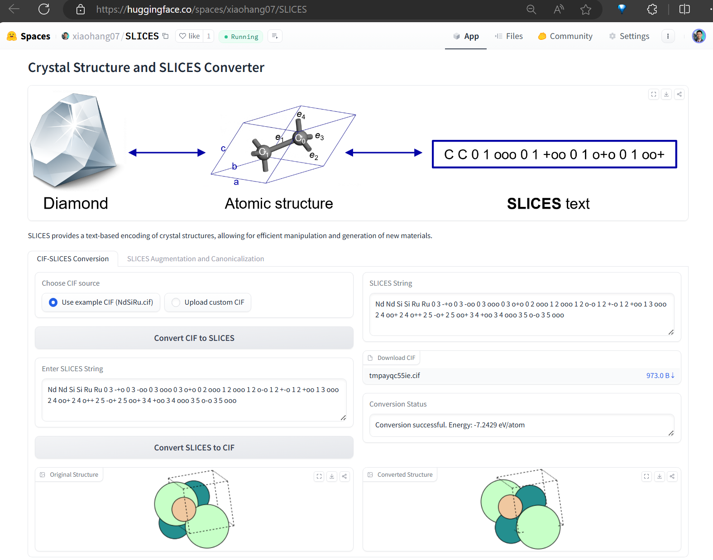
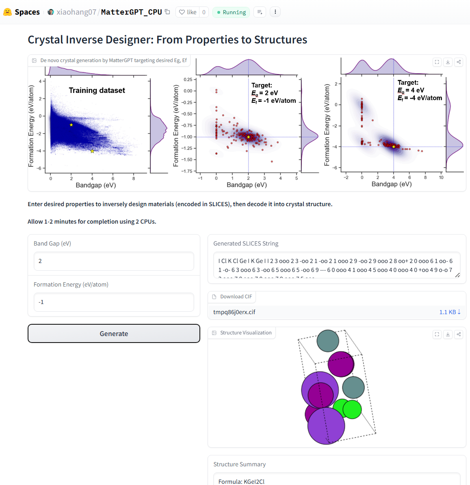

# Simplified Line-Input Crystal-Encoding System (SLICES)

<div align="center">



**The First Invertible and Invariant Crystal Representation Tool**

[](https://www.python.org/downloads/)
[](LICENSE)
[](https://xiaohang007.github.io/SLICES/)

[Online Converter](#online-tools) • [Installation](#installation) • [Quick Start](#quick-start) • [Documentation](#documentation)

</div>

---

## 🌟 Overview

The **Simplified Line-Input Crystal-Encoding System (SLICES)** is a revolutionary tool for crystal structure representation that enables:

- ✅ **Invertible Encoding**: Convert crystal structures to compact string representations and reconstruct them perfectly
- ✅ **Invariant Representation**: Generate consistent representations regardless of coordinate system or unit cell choice
- ✅ **Text-to-Crystal**: Reconstruct crystal structures from SLICES strings with high accuracy
- ✅ **Inverse Design**: Generate new materials with desired properties using generative AI (MatterGPT)

**Key Features:**
- 🎯 **100% Encoding Success Rate** on diverse crystal structures
- 🔄 **High-Fidelity Reconstruction** with MLIP-based geometry optimization
- 🚀 **Multiple MLIP Support**: M3GNet, CHGNet, MatGL, MatterSim, ORBv3
- 🖥️ **Cross-Platform**: Works on macOS, Linux, and Windows (via WSL2)
- 📦 **Easy Installation**: Simple setup with conda and pip

---

## 📚 Related Publications and Resources

| Resource | Link |
|----------|------|
| **Nature Communications Paper** | [View Paper](https://www.nature.com/articles/s41467-023-42870-7) |
| **MatterGPT Paper** | [arXiv:2408.07608](https://arxiv.org/abs/2408.07608) |
| **SLICES-PLUS Paper** | [arXiv:2410.22828](https://arxiv.org/abs/2410.22828) |
| **Online SLICES/CIF Converter** | [Try Online](https://huggingface.co/spaces/xiaohang07/SLICES) |
| **MatterGPT Demo** | [Huggingface Space](https://huggingface.co/spaces/xiaohang07/MatterGPT_CPU) |
| **Data and Results** | [Figshare](https://doi.org/10.6084/m9.figshare.22707472) |
| **MP Novelty Check Library** | [Figshare](https://doi.org/10.6084/m9.figshare.28645331) |

**Video Tutorials (Chinese):**
- [MatterGPT 图形界面介绍](https://www.bilibili.com/video/BV15XrmYMEYU/)
- [SLICES 晶体语言介绍](https://www.bilibili.com/video/BV17H4y1W7aZ/)
- [SLICES 101](https://www.bilibili.com/video/BV1Yr42147dM/)

---

## 🎯 Main Functionalities

### 1. **Crystal Structure Encoding** (`structure2SLICES`)
Convert any crystal structure (CIF, POSCAR, etc.) into a compact SLICES string representation.

### 2. **Crystal Structure Decoding** (`SLICES2structure`)
Reconstruct the original crystal structure from a SLICES string with high accuracy using MLIP-based relaxation.

### 3. **Inverse Design with MatterGPT**
Generate new crystal structures with desired properties using generative deep learning.

### 4. **SLICES-PLUS**
Enhanced version leveraging spatial symmetry for improved representation quality.

---

## 🚀 Quick Start

### Online Tools (No Installation Required)

**SLICES/CIF Converter:**
[](https://huggingface.co/spaces/xiaohang07/SLICES)

**MatterGPT Demo:**
[](https://huggingface.co/spaces/xiaohang07/MatterGPT_CPU)

### Local Installation

```python
from slices.core import SLICES
from pymatgen.core.structure import Structure

# Load a crystal structure
structure = Structure.from_file('examples/NdSiRu.cif')

# Initialize SLICES backend
backend = SLICES(relax_model='chgnet')

# Encode to SLICES string
slices_string = backend.structure2SLICES(structure)
print(f"SLICES: {slices_string}")

# Decode back to structure
reconstructed, energy = backend.SLICES2structure(slices_string)
print(f"Energy: {energy:.4f} eV/atom")
```

---

## 📋 Table of Contents

1. [Installation](#-installation)
   - [macOS Installation](#macos-installation)
   - [Linux Installation](#linux-installation)
   - [Windows Installation](#windows-11-installation-via-wsl2)
   - [Docker Installation](#docker-installation)
2. [Codebase Structure](#-codebase-structure)
3. [Configuration Guide](#-configuration-guide)
   - [Relaxer Settings](#relaxer-settings)
   - [MLIP Model Selection](#mlip-model-selection)
   - [Optimization Parameters](#optimization-parameters)
   - [Graph Method Selection](#graph-method-selection)
4. [Machine Learning Interatomic Potentials (MLIP)](#-machine-learning-interatomic-potentials-mlip-support)
5. [XTB Binary for Decoding](#-xtb-binary-for-decoding)
6. [Testing](#-testing)
7. [Examples](#-examples)
8. [Troubleshooting](#-troubleshooting)
9. [Documentation](#-documentation)
10. [Citation](#-citation)

---

## 💻 Installation

### macOS Installation

**Prerequisites:**
- macOS 10.15 (Catalina) or later
- Xcode Command Line Tools: `xcode-select --install`
- Homebrew (optional, recommended)

**Step 1: Install Miniconda**

```bash
# Download Miniconda for macOS
curl -O https://repo.anaconda.com/miniconda/Miniconda3-latest-MacOSX-x86_64.sh

# For Apple Silicon (M1/M2/M3) Macs:
# curl -O https://repo.anaconda.com/miniconda/Miniconda3-latest-MacOSX-arm64.sh

# Install Miniconda
bash Miniconda3-latest-MacOSX-x86_64.sh -b -p ~/miniconda3

# Initialize conda
~/miniconda3/bin/conda init zsh  # or 'bash' if using bash
source ~/.zshrc
```

**Step 2: Clone and Install SLICES**

```bash
# Clone repository
git clone https://github.com/xiaohang007/SLICES.git
cd SLICES

# Create conda environment
conda create --name slices python=3.9 -y
conda activate slices

# Install core dependencies
pip install tensorflow-cpu==2.13.0
pip install --no-deps m3gnet
pip install smact==2.5.5 ase==3.22.1 pymatgen==2024.8.9
pip install scipy==1.13.0 scikit-learn==1.3.1 numpy==1.26.4

# Install PyTorch (CPU version)
pip install torch torchvision

# Install Gradio for GUI
pip install gradio==4.44.1

# Install SLICES package
pip install -e .

# Install MLIP models (optional, recommended)
pip install chgnet matgl mattersim orb-models
```

**Step 3: Access Graphical Interface**

```bash
cd MatterGPT_no_flash
python app.py
```

Hold `Command` and click the `http://localhost:7860` link to open MatterGPT.

---

### Linux Installation

**Step 1: Install Miniconda**

```bash
sudo apt-get update
sudo apt-get install wget -y
mkdir -p ~/miniconda3
wget https://repo.anaconda.com/miniconda/Miniconda3-latest-Linux-x86_64.sh -O ~/miniconda3/miniconda.sh
bash ~/miniconda3/miniconda.sh -b -u -p ~/miniconda3
rm ~/miniconda3/miniconda.sh
source ~/miniconda3/bin/activate
conda init --all
```

**Step 2: Clone and Install SLICES**

```bash
git clone https://github.com/xiaohang007/SLICES.git
cd SLICES

conda create --name slices python=3.9 -y
conda activate slices

# Install dependencies
pip install tensorflow-cpu==2.13.0 --no-deps m3gnet
pip install smact==2.5.5 ase==3.22.1 pymatgen==2024.8.9
pip install scipy==1.13.0 scikit-learn==1.3.1 numpy==1.26.4

# Install PyTorch (with CUDA if available)
pip3 install torch torchvision --index-url https://download.pytorch.org/whl/cu121

# Install Gradio
pip install gradio==4.44.1

# Install SLICES
pip install -e .

# Install MLIP models
pip install chgnet matgl mattersim orb-models

# Optional: Install flash-attention for GPU acceleration
wget https://github.com/Dao-AILab/flash-attention/releases/download/v2.8.2/flash_attn-2.8.2+cu12torch2.5cxx11abiFALSE-cp39-cp39-linux_x86_64.whl
pip install flash_attn-2.8.2+cu12torch2.5cxx11abiFALSE-cp39-cp39-linux_x86_64.whl || echo "Flash attention failed, use MatterGPT_no_flash"
```

---

### Windows 11 Installation (via WSL2)

**Prerequisites:**
- Windows 11 with WSL2 and Ubuntu installed
- Docker Desktop (optional)

**Steps:**
1. Install WSL2 with Ubuntu
2. Follow the [Linux Installation](#linux-installation) instructions above
3. Configure Docker Desktop to use WSL2 backend (if using Docker)

---

### Docker Installation

**Prerequisites:**
- Docker Desktop installed and running
- For Windows: WSL2 with Docker Desktop configured

**Steps:**

```bash
# Clone repository
git clone https://github.com/xiaohang007/SLICES.git
cd SLICES

# Configure CPU threads (edit slurm.conf)
sed -i 's/CPUs=8/CPUs=16/' slurm.conf  # Linux
sed -i '' 's/CPUs=8/CPUs=16/' slurm.conf  # macOS

# Pull Docker image
docker pull xiaohang07/slices:v12

# Make scripts executable
chmod +x entrypoint_set_cpus_gradio.sh entrypoint_set_cpus.sh ./src/slices/xtb_noring_nooutput_nostdout_noCN

# Run container (Linux with GPU)
docker run -it -p 7860:7860 -h workq --shm-size=0.5gb --gpus all -v $(pwd):/crystal xiaohang07/slices:v12 /crystal/entrypoint_set_cpus_gradio.sh

# Run container (macOS, no GPU)
docker run -it -p 7860:7860 -h workq --shm-size=0.5gb -v $(pwd):/crystal xiaohang07/slices:v12 /crystal/entrypoint_set_cpus_gradio.sh
```

---

## 📁 Codebase Structure

```
SLICES/
├── src/slices/                    # Core SLICES package
│   ├── __init__.py               # Package initialization
│   ├── core.py                   # Main SLICES class (encoding/decoding, ~2245 lines)
│   ├── mlip_relaxer.py          # MLIP model adapters (M3GNet, CHGNet, etc., ~260 lines)
│   ├── tobascco_net.py          # Graph theory implementation (from tobascco, ~500+ lines)
│   ├── utils.py                  # Utility functions
│   ├── utils_wyckoff.py         # Wyckoff position utilities
│   ├── config.py                # Configuration constants
│   ├── xtb_noring_nooutput_nostdout_noCN  # Custom XTB binary (macOS ARM64, ~4.4 MB)
│   └── MP-2021.2.8-EFS/         # M3GNet model files (checkpoint, data, index, json)
│
├── examples/                     # Example scripts
│   ├── 2.1structure2SLICES_SLICES2structure.py
│   ├── 2.2data_augmentation_get_canonical_slices.py
│   ├── NdSiRu.cif
│   └── Sr3Ru2O7.cif
│
├── MatterGPT/                    # MatterGPT with flash-attention (Linux/GPU)
│   ├── app.py                   # Gradio GUI application
│   ├── 0_dataset/               # Dataset preparation
│   ├── 1_train_generate/        # Training and generation
│   ├── 2_decode/                # Decoding pipeline
│   └── 3_novelty/               # Novelty checking
│
├── MatterGPT_no_flash/           # MatterGPT without flash-attention (macOS/CPU)
│   └── [Same structure as MatterGPT/]
│
├── HTS/                         # High-Throughput Screening workflow
│   ├── 0_get_json_mp_api/      # Fetch data from Materials Project
│   ├── 1_augmentation/         # Data augmentation
│   ├── 2_train_sample/         # Training scripts
│   ├── 3_inverse/              # Inverse design
│   └── [Additional filtering/refinement steps]
│
├── benchmark/                    # Benchmarking scripts
│   ├── 1_Match_rate_MP-20/
│   ├── 2_Match_rate_MP-21-40/
│   └── benchmarks.md
│
├── data/                        # Datasets
│   ├── mp20/                    # MP-20 dataset
│   └── mp20_nonmetal/           # MP-20 non-metal subset
│
├── test_slices_functions.py     # Comprehensive test suite (encoding + decoding)
├── test_slices_encoding_only.py # Encoding-only test suite
├── README.md                    # This file
└── pyproject.toml              # Package configuration
```

### Key Modules

**`src/slices/core.py`** - Main SLICES class (~2245 lines)
- **`SLICES.__init__()`**: Initialize with configuration options (relax_model, fmax, steps, optimizer, graph_method, etc.)
- **`structure2SLICES()`**: Encode crystal structure to SLICES string representation
- **`SLICES2structure()`**: Decode SLICES string to crystal structure (high-level interface)
- **`to_structures()`**: Internal decoding with multiple optimization stages (barycentric embedding, ZL* optimization, MLIP relaxation)
- **`relax()`**: MLIP-based relaxation for small structures (≤20 atoms, 360s timeout)
- **`relax_large_cell1()`**: MLIP relaxation for medium structures (21-40 atoms, 720s timeout)
- **`relax_large_cell2()`**: MLIP relaxation for large structures (>40 atoms, 2000s timeout)
- **`get_inner_p_target()`**: Compute bond/angle parameters using XTB and GFN-FF
- **`from_SLICES()`**: Parse SLICES string to extract graph topology (atom types, edge indices, edge labels)
- **`structure2structure_graph()`**: Convert pymatgen Structure to StructureGraph using selected graph method
- **`function_timeout()`**: Decorator for cross-platform timeout handling (prevents infinite loops)
- **`suppress_output()`**: Context manager to silence verbose MLIP output during relaxation

**`src/slices/mlip_relaxer.py`** - MLIP model adapters (~260 lines)
- **`MLIPRelaxer`**: Abstract base class defining the `relax()` interface
- **`M3GNetRelaxer`**: Adapter for M3GNet (Materials Project model, TensorFlow-based)
- **`CHGNetRelaxer`**: Adapter for CHGNet (charge-informed GNN, PyTorch-based)
- **`MatGLRelaxer`**: Adapter for MatGL (newer Materials Project model, supports FIRE/BFGS optimizers)
- **`MatterSimRelaxer`**: Adapter for MatterSim (Microsoft's ML potential, auto-downloads models)
- **`ORBv3Relaxer`**: Adapter for ORBv3 (Orbital Materials potential, multiple model variants)
- **`get_relaxer()`**: Factory function to instantiate the correct relaxer based on model name

**`src/slices/tobascco_net.py`** - Graph theory backend (~500+ lines)
- **`Net`**: Network representation for crystal graphs (nodes = atoms, edges = bonds)
- **`get_lattice_basis()`**: Compute lattice basis from cycle vectors (may return -1 for incompatible topologies)
- Graph analysis, cycle basis computation, lattice basis computation
- Modified from [tobascco](https://github.com/peteboyd/tobascco) project
- Handles periodic boundary conditions and graph isomorphism

**`src/slices/utils.py`** - Utility functions
- Helper functions for structure manipulation
- Element and composition utilities
- Graph transformation utilities

**`src/slices/utils_wyckoff.py`** - Wyckoff position utilities
- Functions for handling Wyckoff positions and space group symmetry
- Used in structure analysis and canonicalization

**`src/slices/config.py`** - Configuration constants
- Default values and configuration parameters
- Constants used throughout the codebase

---

## ⚙️ Configuration Guide

### Relaxer Settings

The SLICES decoder uses Machine Learning Interatomic Potentials (MLIPs) to optimize reconstructed structures. You can configure the relaxation process through several parameters:

#### Basic Configuration

```python
from slices.core import SLICES

backend = SLICES(
    relax_model="chgnet",    # MLIP model to use
    fmax=0.2,                # Force convergence criterion (eV/Å)
    steps=100,                # Maximum optimization steps
    optimizer="BFGS",        # Optimizer algorithm
    graph_method="econnn",   # Graph construction method
    check_results=False      # Enable debug output
)
```

#### Parameter Details

| Parameter | Type | Default | Description |
|-----------|------|---------|-------------|
| `relax_model` | str | `"m3gnet"` | MLIP model: `"m3gnet"`, `"chgnet"`, `"matgl"`, `"mattersim"`, `"orbv3"` |
| `fmax` | float | `0.2` | Maximum force convergence criterion in eV/Å. Lower = stricter convergence |
| `steps` | int | `100` | Maximum number of optimization steps. More steps = better convergence (but slower) |
| `optimizer` | str | `"BFGS"` | Optimizer algorithm. Options depend on MLIP model |
| `graph_method` | str | `"econnn"` | Method for constructing structure graphs: `"econnn"`, `"crystalnn"`, `"brunnernn"`, `"mininn"` |
| `check_results` | bool | `False` | If `True`, saves intermediate files for debugging |

#### Force Convergence (`fmax`)

The `fmax` parameter controls when the relaxation is considered converged:

- **`fmax=0.2`** (default): Standard convergence, suitable for most cases
- **`fmax=0.1`**: Tighter convergence, better accuracy but slower
- **`fmax=0.05`**: Very tight convergence, highest accuracy but much slower
- **`fmax=0.5`**: Looser convergence, faster but less accurate

**Example:**
```python
# High-accuracy relaxation
backend = SLICES(relax_model="chgnet", fmax=0.1, steps=200)

# Fast relaxation (for testing)
backend = SLICES(relax_model="chgnet", fmax=0.5, steps=50)
```

#### Maximum Steps (`steps`)

Controls the maximum number of optimization iterations:

- **`steps=100`** (default): Good balance between accuracy and speed
- **`steps=200`**: More thorough optimization, better for complex structures
- **`steps=50`**: Faster, may not fully converge for difficult structures

**Note:** The optimizer may converge before reaching the maximum steps if `fmax` is satisfied.

#### Timeout Limits by Structure Size

The decoder automatically uses different timeout limits based on structure complexity:

| Structure Size | Method | Timeout | Use Case |
|----------------|--------|---------|----------|
| ≤20 atoms | `relax()` | 360 seconds | Small unit cells |
| 21-40 atoms | `relax_large_cell1()` | 720 seconds | Medium unit cells |
| >40 atoms | `relax_large_cell2()` | 2000 seconds | Large unit cells |

These timeouts prevent infinite loops and can be adjusted in `core.py` if needed.

---

### MLIP Model Selection

#### Available Models

| Model | Package | Optimizer Options | Best For |
|-------|---------|-------------------|----------|
| **M3GNet** | `m3gnet` | `"BFGS"` | Default, well-integrated |
| **CHGNet** | `chgnet` | `"BFGS"` | Recommended alternative, charge-informed |
| **MatGL** | `matgl` | `"FIRE"`, `"BFGS"` | Newer Materials Project model |
| **MatterSim** | `mattersim` | Auto-selected | Microsoft's deep learning potential |
| **ORBv3** | `orb-models` | Auto-selected | Orbital Materials potential |

#### Model-Specific Configuration

**M3GNet (Default):**
```python
backend = SLICES(
    relax_model="m3gnet",
    optimizer="BFGS",  # Only BFGS supported
    fmax=0.2,
    steps=100
)
```

**CHGNet (Recommended):**
```python
backend = SLICES(
    relax_model="chgnet",
    optimizer="BFGS",  # Only BFGS supported
    fmax=0.2,
    steps=100
)
```

**MatGL:**
```python
backend = SLICES(
    relax_model="matgl",
    optimizer="FIRE",  # FIRE or BFGS
    fmax=0.2,
    steps=100
)
```

**MatterSim:**
```python
backend = SLICES(
    relax_model="mattersim",
    # Optimizer auto-selected by MatterSim
    fmax=0.2,
    steps=100
)
```

**ORBv3:**
```python
backend = SLICES(
    relax_model="orbv3",
    # Optimizer auto-selected by ORBv3
    fmax=0.2,
    steps=100
)
```

#### Model Comparison

| Feature | M3GNet | CHGNet | MatGL | MatterSim | ORBv3 |
|---------|--------|--------|-------|-----------|-------|
| **Installation** | Included | `pip install chgnet` | `pip install matgl` | `pip install mattersim` | `pip install orb-models` |
| **Speed** | Medium | Fast | Medium | Fast | Medium |
| **Accuracy** | Good | Excellent | Excellent | Good | Excellent |
| **Stability** | Good | Excellent | Good | Good | Good |
| **GPU Support** | Limited | Yes | Yes | Yes | Yes |
| **Recommended** | ⭐ | ⭐⭐⭐ | ⭐⭐ | ⭐⭐ | ⭐⭐ |

**Recommendation:** Use **CHGNet** for best balance of speed, accuracy, and stability.

---

### Optimization Parameters

#### Encoding Workflow (`structure2SLICES`)

The encoding process converts a crystal structure to a SLICES string:

1. **Structure Graph Construction**: Build labeled quotient graph using selected graph method (EconNN, CrystalNN, etc.)
2. **Graph Canonicalization**: Apply canonical labeling to ensure invariant representation
3. **SLICES String Generation**: Convert graph to compact string format:
   - Atom symbols (element names)
   - Edge indices (atom pairs)
   - Edge labels (periodic boundary conditions: `-`, `o`, `+` for -1, 0, +1)
   - Space group number (optional, depending on strategy)

**SLICES String Format:**
```
[Atom1] [Atom2] ... [AtomN] [Edge1_i] [Edge1_j] [Edge1_a] [Edge1_b] [Edge1_c] [Edge2_i] ...
```

**Components:**
- **Atoms**: Element symbols (e.g., `Nd`, `Si`, `Ru`) - one per atom in the unit cell
- **Edges**: `[i j a b c]` where:
  - `i, j`: Atom indices (0-based, referring to atoms in the atom list)
  - `a, b, c`: Periodic boundary condition labels:
    - `-` = -1 (negative direction)
    - `o` = 0 (same unit cell)
    - `+` = +1 (positive direction)

**Example SLICES String:**
```
Nd Si Ru 0 1 o o o 1 2 o o o 0 2 o o o
```
This represents:
- 3 atoms: Nd, Si, Ru
- 3 edges: Nd-Si (same cell), Si-Ru (same cell), Nd-Ru (same cell)

**Properties:**
- **Invertible**: Can reconstruct original structure from SLICES string
- **Invariant**: Same structure always produces same canonical SLICES (regardless of coordinate system)
- **Compact**: Typically much shorter than CIF format
- **Graph-based**: Represents crystal as a labeled quotient graph

#### Decoding Optimization Stages

The `SLICES2structure()` function performs a multi-stage optimization:

1. **Graph Reconstruction**: Parse SLICES string to extract graph topology (atom types, edge indices, edge labels)
2. **XTB Calculation**: 
   - Generate topology file (`.top` format) with neighbor lists
   - Call XTB with GFN-FF: `xtb --gfnff testBonds_cut.top --wrtopo blist,vbond,alist,vangl`
   - Read `gfnff_lists.json` to get bond/angle parameters
3. **Barycentric Embedding**: Generate initial structure from graph with rescaled lattice based on average bond scaling
4. **ZL* Optimization**: Non-barycentric embedding that matches XTB-predicted bond lengths and angles
5. **MLIP Relaxation**: Final structure optimization using selected MLIP model with cell optimization

#### Advanced Decoding Parameters

The `to_structures()` method (called internally by `SLICES2structure()`) accepts additional parameters for fine-tuning the structure reconstruction:

```python
structures, energy = backend.to_structures(
    bond_scaling=1.05,              # Bond length scaling factor
    delta_theta=0.005,              # Angle change limit (deprecated, kept for compatibility)
    delta_x=0.45,                  # Maximum coordinate change allowed
    lattice_shrink=1,              # Minimum lattice scaling factor
    lattice_expand=1.25,           # Maximum lattice scaling factor
    angle_weight=0.5,              # Weight for angle terms in objective function
    vbond_param_ave_covered=0.00, # Repulsive potential well depth (covered bonds)
    vbond_param_ave=0.01,         # Repulsive potential well depth (uncovered pairs)
    repul=True                     # Enable repulsive potential in objective
)
```

**Parameter Details:**

| Parameter | Type | Default | Description |
|-----------|------|---------|-------------|
| `bond_scaling` | float | `1.05` | Multiplicative factor for bond lengths. Values > 1.0 increase bond lengths. Typical range: 1.0-1.1 |
| `delta_x` | float | `0.45` | Maximum allowed change in fractional coordinates during optimization. Higher = more flexibility |
| `lattice_shrink` | float | `1.0` | Minimum lattice scaling factor. Values < 1.0 allow lattice contraction |
| `lattice_expand` | float | `1.25` | Maximum lattice scaling factor. Values > 1.0 allow lattice expansion (up to 25% by default) |
| `angle_weight` | float | `0.5` | Weight for angle terms in the objective function. Higher = stricter angle constraints |
| `vbond_param_ave_covered` | float | `0.00` | Repulsive potential depth for atom pairs connected by edges (covered bonds) |
| `vbond_param_ave` | float | `0.01` | Repulsive potential depth for atom pairs not connected by edges (prevents overlap) |
| `repul` | bool | `True` | Enable/disable repulsive potential terms in optimization |

**Typical Values:**
- `bond_scaling=1.05`: Standard bond scaling (5% increase), suitable for most structures
- `bond_scaling=1.0`: No scaling, use XTB-predicted bond lengths directly
- `lattice_expand=1.25`: Allow up to 25% lattice expansion (good default)
- `lattice_expand=1.5`: More flexible, allows up to 50% expansion (for complex structures)
- `angle_weight=0.5`: Moderate weight for angle constraints (balanced)
- `angle_weight=1.0`: Strong angle constraints (for structures with specific angles)

**Return Values:**
The `to_structures()` method returns:
- **`structures`**: List of 3 pymatgen Structure objects:
  1. Rescaled structure (barycentric embedding with rescaled lattice)
  2. ZL*-optimized structure (non-barycentric embedding matching bond lengths/angles)
  3. MLIP-optimized structure (final relaxed structure with cell optimization)
- **`energy`**: Energy per atom (eV/atom) predicted by the selected MLIP model

**Note:** If MLIP relaxation fails, only the first two structures are returned.

---

### Graph Method Selection

The `graph_method` parameter controls how the structure graph is constructed:

| Method | Description | Best For |
|--------|-------------|----------|
| `"econnn"` | EconNN (default) | General purpose, recommended |
| `"crystalnn"` | CrystalNN | Complex coordination environments |
| `"brunnernn"` | BrunnerNN | Reciprocal space analysis |
| `"mininn"` | MinimumDistanceNN | Simple distance-based |

**Example:**
```python
# Use CrystalNN for complex structures
backend = SLICES(graph_method="crystalnn")
```

---

## 🔬 Machine Learning Interatomic Potentials (MLIP) Support

### Installation

```bash
# Install all MLIP models
pip install chgnet matgl mattersim orb-models

# Or install individually
pip install chgnet      # Recommended
pip install matgl       # Newer Materials Project model
pip install mattersim   # Microsoft's potential
pip install orb-models  # Orbital Materials potential
```

### Usage Examples

```python
from slices.core import SLICES
from pymatgen.core.structure import Structure

structure = Structure.from_file('examples/NdSiRu.cif')

# Test different MLIP models
models = ["chgnet", "matgl", "mattersim", "orbv3"]

for model in models:
    backend = SLICES(relax_model=model, fmax=0.2, steps=100)
    slices_string = backend.structure2SLICES(structure)
    reconstructed, energy = backend.SLICES2structure(slices_string)
    print(f"{model:12s}: {energy:8.4f} eV/atom")
```

### Model Details

#### CHGNet (Recommended)

- **Package**: `chgnet`
- **Features**: Charge-informed, fast, accurate
- **Use Case**: General purpose, recommended default

```python
backend = SLICES(relax_model="chgnet", fmax=0.2, steps=100)
```

#### MatGL

- **Package**: `matgl`
- **Features**: Newer Materials Project model, improved accuracy
- **Use Case**: When highest accuracy is needed

```python
backend = SLICES(relax_model="matgl", optimizer="FIRE", fmax=0.2, steps=100)
```

#### MatterSim

- **Package**: `mattersim`
- **Features**: Microsoft's deep learning potential, auto-downloads model
- **Use Case**: Alternative to CHGNet/MatGL

```python
backend = SLICES(relax_model="mattersim", fmax=0.2, steps=100)
```

#### ORBv3

- **Package**: `orb-models`
- **Features**: Orbital Materials potential, multiple model variants
- **Use Case**: Specialized materials (organic, infinite materials)

```python
backend = SLICES(relax_model="orbv3", fmax=0.2, steps=100)
```

---

## 🔧 XTB Binary for Decoding

### Overview

The `SLICES2structure` (decoding) function requires a custom XTB (Extended Tight-Binding) binary to compute bond and angle parameters from topology files using GFN-FF (Geometry, Frequency, Noncovalent interactions - Force Field).

**Why a Custom Binary?**
The standard XTB binary from conda-forge does not support the `.top` file format used by SLICES. The xiaohang007/xtb repository includes modifications that:
- Add support for reading neighbor lists from `.top` files (via `xtb_io_reader_top` module)
- Initialize GFN-FF calculations using topology data instead of Cartesian coordinates
- Set coordination numbers from atom types rather than computing from coordinates

### Current Status

- ✅ **macOS ARM64 (Apple Silicon)**: A compatible binary is included at `src/slices/xtb_noring_nooutput_nostdout_noCN`
- ✅ **Encoding (`structure2SLICES`)**: Works perfectly on all platforms (100% success rate)
- ✅ **Decoding (`SLICES2structure`)**: macOS-compatible XTB binary included and tested

### How XTB is Used in SLICES

1. **During Decoding**: When `SLICES2structure()` is called, it:
   - Generates a topology file (`testBonds_cut.top`) containing neighbor lists and atom types
   - Calls XTB with GFN-FF to compute bond/angle parameters: `xtb --gfnff testBonds_cut.top --wrtopo blist,vbond,alist,vangl`
   - Reads the output JSON file (`gfnff_lists.json`) containing bond lists, bond parameters, angle lists, and angle parameters
   - Uses these parameters to compute inner product targets for structure optimization

2. **Binary Detection**: The codebase automatically:
   - Checks for the bundled binary at `src/slices/xtb_noring_nooutput_nostdout_noCN`
   - Verifies it's executable and compatible with the system
   - Falls back to system-installed XTB if the bundled binary is not found (with a warning)

### Building XTB from Source (macOS)

If you need to rebuild the binary for your system, follow these steps:

**Step 1: Install Build Dependencies**
```bash
# Install CMake, Ninja, and GCC Fortran compiler
conda install -c conda-forge cmake ninja gfortran
# Or on macOS with Homebrew:
brew install cmake ninja gcc
```

**Step 2: Clone the Repository**
```bash
git clone https://github.com/xiaohang007/xtb.git
cd xtb
```

**Step 3: Fix CMakeLists.txt (Required)**
The `top.f90` module must be included in the build. Edit `src/io/reader/CMakeLists.txt`:

```cmake
set(dir "${CMAKE_CURRENT_SOURCE_DIR}")

list(APPEND srcs
  "${dir}/ctfile.f90"
  "${dir}/gaussian.f90"
  "${dir}/genformat.f90"
  "${dir}/orca.f90"
  "${dir}/pdb.f90"
  "${dir}/top.f90"          # Add this line
  "${dir}/turbomole.f90"
  "${dir}/vasp.f90"
  "${dir}/xyz.f90"
)

set(srcs ${srcs} PARENT_SCOPE)
```

**Step 4: Configure and Build**
```bash
# Configure the build
cmake -B build \
  -DCMAKE_BUILD_TYPE=Release \
  -DCMAKE_Fortran_COMPILER=gfortran \
  -DCMAKE_C_COMPILER=gcc

# Build (use -j4 for parallel compilation)
make -C build -j4

# Verify the binary was created
ls -lh build/xtb
file build/xtb  # Should show: Mach-O 64-bit executable arm64 (for macOS ARM64)
```

**Step 5: Install the Binary**
```bash
# Copy to SLICES directory
cp build/xtb /path/to/SLICES/src/slices/xtb_noring_nooutput_nostdout_noCN
chmod +x /path/to/SLICES/src/slices/xtb_noring_nooutput_nostdout_noCN

# Verify it's executable
./src/slices/xtb_noring_nooutput_nostdout_noCN --version
```

### Verifying XTB Works

**Test 1: Basic Functionality**
```python
from slices.core import SLICES
from pymatgen.core.structure import Structure

# Load a test structure
structure = Structure.from_file('examples/NdSiRu.cif')
backend = SLICES(relax_model='chgnet')

# Test encoding
slices_string = backend.structure2SLICES(structure)
print(f"✓ Encoding successful: {len(slices_string)} chars")

# Test decoding (this uses XTB)
reconstructed, energy = backend.SLICES2structure(slices_string)
print(f"✓ Decoding successful!")
print(f"  Original: {structure.formula}")
print(f"  Reconstructed: {reconstructed.formula}")
print(f"  Energy: {energy:.4f} eV/atom")
```

**Test 2: Check XTB Binary Path**
```python
import os
print(f"XTB path: {os.environ.get('XTB_MOD_PATH', 'Not set')}")
```

**Test 3: Direct XTB Test**
```bash
# Create a test topology file
cat > test.top << EOF
2
C C
1 2
0 0
0 0
0 0
0 0
0 0
0 0
0 0
0 0
0 0
0 0
0 0
0 0
0 0
0 0
0 0
0 0
0 0
0 0
0 0
EOF

# Test XTB
./src/slices/xtb_noring_nooutput_nostdout_noCN --gfnff test.top --wrtopo blist,vbond,alist,vangl

# Check output
ls -lh gfnff_lists.json  # Should exist
```

### Troubleshooting XTB Issues

**Issue: "Cannot find module file 'xtb_io_reader_top.mod'"**
- **Cause**: The `top.f90` module wasn't included in the build
- **Solution**: Ensure `src/io/reader/CMakeLists.txt` includes `"${dir}/top.f90"` in the source list

**Issue: "FileNotFoundError: gfnff_lists.json"**
- **Cause**: XTB execution failed or binary is incompatible
- **Solution**: 
  - Verify the binary is executable: `chmod +x src/slices/xtb_noring_nooutput_nostdout_noCN`
  - Check binary architecture: `file src/slices/xtb_noring_nooutput_nostdout_noCN`
  - Test XTB directly (see Test 3 above)
  - Check XTB stderr output for error messages

**Issue: "cannot execute binary file"**
- **Cause**: Binary architecture mismatch (e.g., Linux binary on macOS)
- **Solution**: Rebuild the binary for your system architecture

**Issue: "XTB exit code: 126"**
- **Cause**: Binary is not executable or missing dependencies
- **Solution**: 
  - Make binary executable: `chmod +x src/slices/xtb_noring_nooutput_nostdout_noCN`
  - Check for missing shared libraries: `otool -L src/slices/xtb_noring_nooutput_nostdout_noCN` (macOS) or `ldd` (Linux)

**Issue: "XTB failed to generate output file. Exit code: 1"**
- **Cause**: XTB execution failed (timeout, invalid input, or binary error)
- **Solution**: 
  - Check XTB stderr output for specific error messages
  - Verify topology file format is correct
  - Ensure all required dependencies are installed
  - Try with a simpler test structure

**Issue: "Failed to parse XTB JSON output"**
- **Cause**: XTB output is malformed or incomplete
- **Solution**: 
  - Check if `gfnff_lists.json` exists and is readable
  - Verify XTB completed successfully (check exit code)
  - Try regenerating the topology file

**Issue: Decoding returns None**
- **Cause**: `get_inner_p_target()` failed (XTB execution error)
- **Solution**: Check XTB binary path and test XTB directly

### Technical Details

**Build Configuration:**
- **Build System**: CMake 3.9+
- **Fortran Compiler**: GCC Fortran (gfortran) 7.5+ or Intel Fortran
- **C Compiler**: GCC or Clang
- **Dependencies**: BLAS, LAPACK (provided by system on macOS via Accelerate framework)
- **Build Type**: Release (optimized)

**Key Files Modified:**
- `src/io/reader/top.f90`: Module for reading `.top` files
- `src/io/reader/CMakeLists.txt`: Must include `top.f90` in build
- `src/gfnff/`: Modified to use topology data instead of coordinates

**Binary Location:**
- Path: `src/slices/xtb_noring_nooutput_nostdout_noCN`
- Environment Variable: `XTB_MOD_PATH` (set automatically by `core.py`)

**XTB Execution Details:**
- **Timeout**: 30 seconds per XTB call (prevents hangs)
- **Output Format**: JSON (`gfnff_lists.json`)
- **Method**: GFN-FF (Geometry, Frequency, Noncovalent interactions - Force Field)
- **Input**: Topology file (`.top` format) with neighbor lists

**Note:** The system XTB from conda (`conda install -c conda-forge xtb`) may not work correctly with SLICES decoding as it lacks the custom modifications required by the codebase. The bundled binary is recommended.

---

## 🧪 Testing

### Encoding Test

```bash
# Test encoding on 50 samples
python test_slices_encoding_only.py --dataset data/mp20/test.csv --samples 50

# Use smaller batch size for limited memory
python test_slices_encoding_only.py --dataset data/mp20/test.csv --samples 50 --batch-size 5
```

### Full Round-Trip Test

```bash
# Test encoding + decoding
python test_slices_functions.py --dataset data/mp20/test.csv --samples 20 --models chgnet

# Test multiple models
python test_slices_functions.py --dataset data/mp20/test.csv --samples 20 --models chgnet mattersim orbv3 --batch-size 5
```

### Test Options

| Option | Description | Default |
|--------|-------------|---------|
| `--dataset` | Path to CSV file | `data/mp20/test.csv` |
| `--samples` | Number of samples | `50` |
| `--models` | MLIP models to test | `chgnet` |
| `--batch-size` | Structures per batch | `10` |

**Memory Optimization:**
- Processes structures in batches
- Clears memory after each batch
- Aggregates statistics incrementally
- Reuses backend instances

---

## 📖 Examples

### Basic Encoding/Decoding

```python
from slices.core import SLICES
from pymatgen.core.structure import Structure

# Load structure
structure = Structure.from_file('examples/NdSiRu.cif')

# Initialize with CHGNet
backend = SLICES(relax_model="chgnet", fmax=0.2, steps=100)

# Encode
slices_string = backend.structure2SLICES(structure)
print(f"SLICES: {slices_string}")

# Decode
reconstructed, energy = backend.SLICES2structure(slices_string)
print(f"Energy: {energy:.4f} eV/atom")
print(f"Formula: {reconstructed.formula}")
```

### Data Augmentation

```python
from slices.core import SLICES
from pymatgen.core.structure import Structure

structure = Structure.from_file('examples/Sr3Ru2O7.cif')
backend = SLICES(graph_method='econnn')

# Generate augmented SLICES
slices_list = backend.structure2SLICESAug_atom_order(structure=structure, num=50)

# Get canonical forms
canonical_slices = list(set(backend.get_canonical_SLICES(s) for s in slices_list))
print(f"Unique canonical SLICES: {len(canonical_slices)}")
```

### Custom Configuration

```python
# High-accuracy relaxation
backend = SLICES(
    relax_model="chgnet",
    fmax=0.1,        # Tighter convergence
    steps=200,       # More steps
    optimizer="BFGS",
    graph_method="crystalnn"
)

# Fast relaxation (for testing)
backend = SLICES(
    relax_model="chgnet",
    fmax=0.5,        # Looser convergence
    steps=50,        # Fewer steps
    check_results=False
)
```

---

## 🐛 Troubleshooting

### Common Issues

**ImportError or ModuleNotFoundError:**
```bash
conda activate slices
pip install -e . --force-reinstall
```

**Timeout Errors:**
- Ensure you're using the latest codebase
- Check system resources (CPU, memory)
- Try reducing `steps` parameter

**Memory Issues:**
- Use smaller batch sizes: `--batch-size 5`
- Test fewer samples: `--samples 10`
- Close other applications

**XTB Binary Issues:**
- Verify binary is executable: `chmod +x src/slices/xtb_noring_nooutput_nostdout_noCN`
- Check architecture: `file src/slices/xtb_noring_nooutput_nostdout_noCN`
- See [XTB Binary Documentation](#xtb-binary-for-decoding) for rebuilding

**MLIP Model Issues:**
- Ensure model is installed: `pip install chgnet`
- Check model compatibility with your Python version
- Try a different model if one fails

For more help, open an issue on [GitHub](https://github.com/xiaohang007/SLICES/issues).

---

## 📚 Documentation

- **Official Documentation**: [Read the Docs](https://xiaohang007.github.io/SLICES/)
- **API Reference**: Available in the documentation
- **Benchmarks Guide**: [benchmark/benchmarks.md](benchmark/benchmarks.md)

---

## 📄 Citation

If you use SLICES, MatterGPT, or SLICES-PLUS, please cite:

```bibtex
@article{xiao2023invertible,
  title={An invertible, invariant crystal representation for inverse design of solid-state materials using generative deep learning},
  author={Xiao, Hang and Li, Rong and Shi, Xiaoyang and Chen, Yan and Zhu, Liangliang and Chen, Xi and Wang, Lei},
  journal={Nature Communications},
  volume={14},
  number={1},
  pages={7027},
  year={2023},
  publisher={Nature Publishing Group UK London}
}

@misc{chen2024mattergptgenerativetransformermultiproperty,
  title={MatterGPT: A Generative Transformer for Multi-Property Inverse Design of Solid-State Materials},
  author={Yan Chen and Xueru Wang and Xiaobin Deng and Yilun Liu and Xi Chen and Yunwei Zhang and Lei Wang and Hang Xiao},
  year={2024},
  eprint={2408.07608},
  archivePrefix={arXiv},
  primaryClass={cond-mat.mtrl-sci},
  url={https://arxiv.org/abs/2408.07608}
}

@misc{wang2024slicespluscrystalrepresentationleveraging,
  title={SLICES-PLUS: A Crystal Representation Leveraging Spatial Symmetry}, 
  author={Baoning Wang and Zhiyuan Xu and Zhiyu Han and Qiwen Nie and Hang Xiao and Gang Yan},
  year={2024},
  eprint={2410.22828},
  archivePrefix={arXiv},
  primaryClass={physics.comp-ph},
  url={https://arxiv.org/abs/2410.22828}
}
```

---

## 🙏 Acknowledgement

Special thanks to:
- [tobascco](https://github.com/peteboyd/tobascco) - Graph theory implementation
- [xtb](https://github.com/grimme-lab/xtb) - Extended Tight-Binding method
- [m3gnet](https://github.com/materialsvirtuallab/m3gnet) - Materials Project MLIP
- [chgnet](https://github.com/CederGroupHub/chgnet) - Charge-informed GNN
- [molgpt](https://github.com/devalab/molgpt) - Molecular GPT inspiration

---

## 📧 Contact and Support

- **Email**: [hangxiao@ln.edu.hk](mailto:hangxiao@ln.edu.hk)
- **ResearchGate**: [Hang Xiao](https://www.researchgate.net/profile/Hang-Xiao-8)
- **GitHub Discussions**: [Start a Discussion](https://github.com/xiaohang007/SLICES/discussions/categories/general)
- **GitHub Issues**: [Report a Bug](https://github.com/xiaohang007/SLICES/issues)

---

## 📝 Quick Reference

### Common Operations

**Basic Encoding/Decoding:**
```python
from slices.core import SLICES
from pymatgen.core.structure import Structure

backend = SLICES(relax_model="chgnet")
structure = Structure.from_file('structure.cif')

# Encode
slices = backend.structure2SLICES(structure)

# Decode
reconstructed, energy = backend.SLICES2structure(slices)
```

**Recommended Settings:**
```python
# High accuracy (slower)
backend = SLICES(relax_model="chgnet", fmax=0.1, steps=200)

# Balanced (default)
backend = SLICES(relax_model="chgnet", fmax=0.2, steps=100)

# Fast (for testing)
backend = SLICES(relax_model="chgnet", fmax=0.5, steps=50)
```

**Available MLIP Models:**
- `"m3gnet"` - Default, well-integrated
- `"chgnet"` - ⭐ Recommended, fast and accurate
- `"matgl"` - Newer Materials Project model
- `"mattersim"` - Microsoft's potential
- `"orbv3"` - Orbital Materials potential

**Graph Methods:**
- `"econnn"` - Default, general purpose
- `"crystalnn"` - Complex coordination environments
- `"brunnernn"` - Reciprocal space analysis
- `"mininn"` - Simple distance-based

**Key Files:**
- `src/slices/core.py` - Main SLICES class
- `src/slices/mlip_relaxer.py` - MLIP adapters
- `src/slices/tobascco_net.py` - Graph theory backend
- `src/slices/xtb_noring_nooutput_nostdout_noCN` - XTB binary (macOS)

---

<div align="center">

**Made with ❤️ by the SLICES Team**

[⬆ Back to Top](#simplified-line-input-crystal-encoding-system-slices)

</div>
